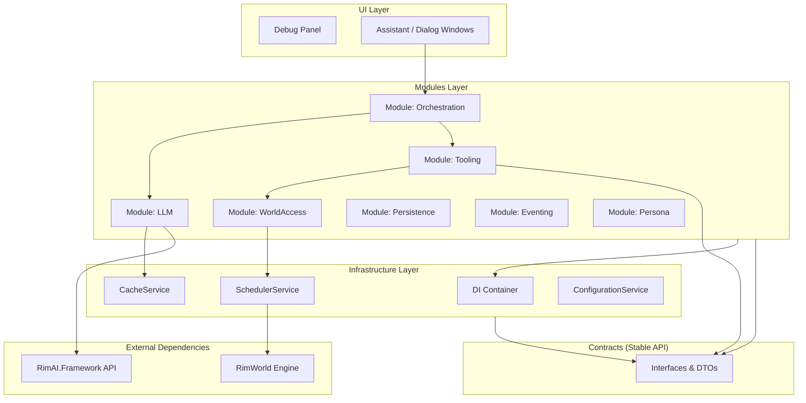

# 🏗️ RimAI Core - V4 Architecture

[English](README.md) | [简体中文](README_zh-CN.md)

> **RimAI Core v4: An incremental, enterprise-grade AI framework for RimWorld, rebuilt for rapid iteration, verifiable progress, and unparalleled extensibility. V4 inherits the robust design philosophy of v3 while adopting a phased delivery model to ensure stability and continuous improvement.**

**✨ V4 Highlights:**
- **Phased Delivery**: Incremental development from P0 to P8, ensuring each stage delivers a verifiable, functional MVP.
- **Modular Architecture**: Clearly defined modules (LLM, WorldAccess, Tooling, Orchestration, etc.) for high cohesion and low coupling.
- **Stable Contract Layer**: A dedicated `Contracts` assembly for stable, versioned APIs, allowing third-party mod integration with confidence.
- **Robust Infrastructure**: Built upon a foundation of Dependency Injection, a centralized Configuration Service, and a resilient Scheduler.
- **Intelligent Orchestration**: A five-step, tool-assisted query workflow that enables complex, multi-step AI interactions.

**Author**: [@oidahdsah0](https://github.com/oidahdsah0)  
**Created**: 16 July 2025  
**Dependencies**: [RimAI Framework](https://github.com/oidahdsah0/Rim_AI_Framework)

---

## 🚀 Getting Started

### Prerequisites
- RimWorld 1.6 or later
- Harmony
- [RimAI.Framework](https://github.com/oidahdsah0/Rim_AI_Framework) (v4.1+ is strictly required)
- API access to a supported LLM service (OpenAI, DeepSeek, Ollama, etc.)

### Installation
⚠️ **CRITICAL: You MUST strictly follow the setup instructions on the RimAI Framework Mod page, or the AI will NOT work!**

1.  **Install [RimAI.Framework](https://github.com/oidahdsah0/Rim_AI_Framework) first.**
2.  Download RimAI Core from the [Steam Workshop](https://steamcommunity.com/sharedfiles/filedetails/?id=TBD) or [GitHub Releases](https://github.com/oidahdsah0/Rimworld_AI_Core/releases).
3.  Configure your LLM API settings in the Framework mod settings menu.
4.  Launch RimWorld and verify the `Debug Panel` for testing the V4 features.

---

## 📐 V4 Architecture Overview

The V4 architecture is designed for clarity, testability, and incremental development. It separates concerns into distinct layers and modules, ensuring that the system is both powerful and maintainable.

### V4 Architecture Diagram

### Core Services & Modules

| Service / Module | Role & Responsibility | Key Feature |
| :--- | :--- | :--- |
| **`ServiceContainer`** | Manages service lifecycles and dependencies. | Enforces SOLID principles through constructor injection. |
| **`ILLMService`** | The sole gateway for all LLM communication. | Centralizes caching, retries, and circuit-breaking. |
| **`IWorldDataService`** | Anti-corruption layer for safe, main-thread game data access. | Uses `ISchedulerService` to prevent threading issues. |
| **`IToolRegistryService`**| Discovers and manages a "toolbox" of AI capabilities. | Enables dynamic extension of AI skills without core changes. |
| **`IOrchestrationService`**| The "brain" that conducts the five-step query workflow. | Integrates tools and data to generate intelligent responses. |
| **`IPersistenceService`** | Manages saving and loading of the AI's state. | Decouples business logic from RimWorld's `Scribe` system. |
| **`IPersonaService`** | Manages AI personalities and their system prompts. | Separates "who the AI is" from "what the AI can do". |

---

## 🔧 Technology & Principles

- **SOLID Principles**: The entire architecture is built on a foundation of SOLID design principles.
- **Async Everywhere**: A full-stack async/await model ensures a responsive, non-blocking UI.
- **Resilience**: A unified exception system, retry policies, and circuit breakers ensure the system is robust against failures.
- **Testability**: A `Debug Panel` provides scripted test cases for each development phase, ensuring end-to-end functionality.
- **Extensibility**: The `IRimAITool` interface and `IToolRegistryService` allow for easy addition of new AI capabilities.

---

## 🤝 Contributing

We welcome contributions! Please see our (forthcoming) `CONTRIBUTING.md` for details on the development process, coding standards, and pull request guidelines.

### Development Roadmap
The V4 implementation is broken down into 8 phases. You can follow the progress in the [V4 Implementation Plan](docs/v4/IMPLEMENTATION_V4.md).

| Phase | Milestone | Status |
| :--- | :--- | :--- |
| **P0** | Skeleton & DI | ✅ Completed |
| **P1** | DI & Config | ✅ Completed |
| **P2** | LLM Gateway | ✅ Completed |
| **P3** | Scheduler & WorldData | ✅ Completed |
| **P4** | Tool System | ✅ Completed |
| **P5** | Orchestration | ✅ Completed |
| **P6** | Persistence | ✅ Completed |
| **P7** | Event Aggregator | ⏳ Pending |
| **P8** | Persona & UI | ⏳ Pending |

---

## 📄 License

This project is licensed under the MIT License - see the [LICENSE](LICENSE) file for details.

---

## 📞 Support

- **Issues**: [GitHub Issues](https://github.com/oidahdsah0/Rimworld_AI_Core/issues)
- **Discussions**: [GitHub Discussions](https://github.com/oidahdsah0/Rimworld_AI_Core/discussions)
- **Steam Workshop**: [Workshop Page](https://steamcommunity.com/sharedfiles/filedetails/?id=TBD)
