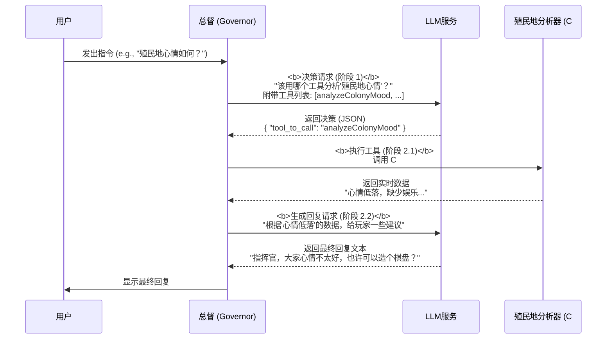

# 🧠 RimAI 对话服务设计

*从被动响应到主动决策的范式转变*

本文档阐述了RimAI对话服务架构的演进历程，从一个复杂的、基于模板填充的系统，到一个更智能、更灵活的、由AI驱动决策的现代架构。

## v2.0 范式：模板填充与高级历史管理

在 `v2.0` 版本中，AI的对话生成严重依赖于**模板填充**模式。该模式的核心是构建一个能详细描述游戏世界状态的、巨大的上下文，然后将其一次性提供给AI。该设计的核心是两个高度耦合的服务：`HistoryService` 和 `PromptFactoryService`。

### 1. 核心设计需求

该设计旨在满足以下核心业务需求：

1.  **多路对话支持**: 系统必须同时管理多个独立的对话，包括1v1和多人对话。
2.  **上下文关联检索**: 在获取对话历史时，必须能找出所有包含当前对话者的相关对话。
3.  **历史主次分层**: 检索出的历史记录必须能够被区分为主线历史和作为背景参考的附加历史。
4.  **游戏时间戳**: 所有的对话记录都必须带有精确到游戏刻度（Tick）的时间戳。
5.  **持久化存储**: 所有对话历史都必须能随游戏存档一起保存和加载。

### 2. 历史对话服务 (`HistoryService`) 设计

`HistoryService` 的职责是存储、索引和检索所有对话历史。它被设计成一个小型对话搜索引擎，采用“**主存储 + 倒排索引**”的双重数据结构来满足复杂的检索需求。

-   **主数据存储**: 一个`Dictionary<ConversationId, List<ConversationEntry>>`，存储所有对话的完整内容。
-   **倒排参与者索引**: 一个`Dictionary<ParticipantId, HashSet<ConversationId>>`，用于快速查找每个参与者参与过的所有对话，是实现高效关联检索的核心。

### 3. 提示词工厂服务 (`PromptFactoryService`) 设计

`PromptFactoryService` 的职责是消费 `HistoryService` 提供的结构化历史，并结合其他上下文，智能地组装成一个可直接发送给LLM的、结构化的提示词负载。它的核心逻辑是：
1.  **获取结构化历史**: 调用`HistoryService`得到主线和附加历史。
2.  **时间戳格式化**: 将游戏Tick时间戳转换为人类和AI可读的字符串。
3.  **组装上下文**: 将系统提示词、附加历史（作为背景资料）、主线历史、场景数据等，按预定顺序组装成一个与OpenAI兼容的消息列表。

### 4. v2.0 范式的局限性

这种模式虽然在当时是先进的，但存在几个根本性的缺陷：
-   **僵化**：无法处理模板之外的用户查询。AI是被动的模板填充者，而不是主动的思考者。
-   **低效**：无论用户问什么，总是要抓取并处理所有类型的历史和上下文数据，造成不必要的性能开销。
-   **上下文质量不高**：LLM得到的是一堆被动灌输的、混合了各种信息的原始数据，而非一个清晰的“任务”，这限制了其进行高质量推理的能力。

---

## v2.1 范式转变：两阶段决策模型 (Two-Stage Decision Model)

为了克服上述缺陷，我们引入了一个全新的、基于AI工具使用的**两阶段决策模型**。这个模型将一次复杂的交互分解为两个更简单、更清晰的步骤，实现了从“被动响应”到“主动决策”的飞跃。

### 1. 核心理念：超越模板，拥抱决策

新范式的核心理念是：**让AI自主选择完成任务所需的工具，而不是被动地接收数据。**

1.  **阶段一：决策（Dispatch）**
    -   **目标**：不直接回答用户，而是让AI**选择合适的工具**。
    -   **过程**：我们将用户的原始查询（如“殖民地心情如何？”）和一份“工具清单”发送给LLM。LLM的任务是像一个聪明的调度员，返回一个结构化的决策，告诉我们：“对于这个请求，我推荐使用`analyzeColonyMood`这个工具”。
    -   **产出**：一个包含工具名称和所需参数的JSON对象。

2.  **阶段二：执行与生成（Execute & Generate）**
    -   **目标**：执行AI选择的工具，并基于其返回的**真实、精确**的数据，生成最终回复。
    -   **过程**：
        a. C#代码解析AI的决策，调用对应的本地服务（如`ColonyAnalyzer`）。
        b. 该服务从游戏中实时抓取**与任务强相关**的数据（例如，只抓取心情数据，而不是所有数据）。
        c. 然后，我们将这些新鲜出炉的数据，连同原始用户请求，再次发送给LLM，并附上一个简单直接的新指令：“根据以下数据，为玩家生成一份关于殖民地心情的报告和建议。”
    -   **产出**：一份高质量的、人类可读的回复。

### 2. 工作流图示

这个新流程可以用下图清晰地表示：

### 3. 设计优势

这种新的对话服务设计带来了革命性的改进：

-   **智能与灵活**：AI不再是被动的模板填充者，而是主动的决策者。系统可以轻松处理各种预料之外的用户查询，只要有合适的工具可供选择。
-   **高效与精准**：系统只在需要时，执行与任务最相关的代码来获取数据，避免了不必要的性能浪费。
-   **高质量回复**：AI的最终回复是基于从游戏中获取的**实时、精确**的数据，而不是基于对一堆混乱信息的模糊猜测，因此回复的质量和相关性都大大提高。
-   **极佳的可扩展性**：为AI赋予新能力，不再需要修改复杂的提示词模板，而仅仅是为它提供一个定义清晰的新“工具”。（详见**[开发者指南](DEVELOP-GUIDE.md)**）

通过这次范式转变，RimAI的对话服务从一个“问答机”进化为了一个真正的“AI智能体”。 