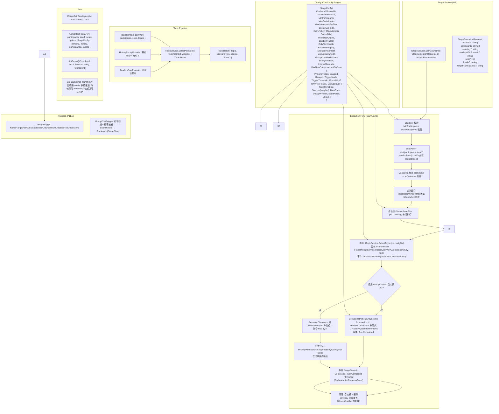

```mermaid
flowchart TD
  subgraph "Stage Service (API)"
    A1["IStageService.StartAsync(req: StageExecutionRequest, ct) : IAsyncEnumerable<Result<UnifiedChatChunk>>"]
    %% Scan 兼容入口已移除，统一由 Triggers 驱动
    A3["StageExecutionRequest{<br/>actName: string<br/>participants: string[]<br/>convKey?: string<br/>userInputOrScenario?: string<br/>seed?: int<br/>locale?: string<br/>targetParticipantId?: string<br/>}"]
  end

  subgraph "Execution Flow (StartAsync)"
    F1["Eligibility 校验<br/>MinParticipants, MaxParticipants 裁剪"]
    F2["convKey = sort(participants).join('|')<br/>seed = hash(convKey) 或 request.seed"]
    F3["Cooldown 检查 (convKey) → InCooldown 拒绝"]
    F4["合流窗口 (CoalesceWindowMs) 收集同 convKey 触发"]
    F5["会话锁 (SemaphoreSlim per convKey) 串行执行"]
    F7["选题: ITopicService.SelectAsync(ctx, weights)<br/>如有 ScenarioText → IFixedPromptService.UpsertConvKeyOverride(convKey, text)<br/>事件: OrchestrationProgressEvent(TopicSelected)"]
    D1{"使用 GroupChatAct 且人数 ≥ 2?"}
    F8["GroupChatAct.RunAsync(ctx)<br/>for round in N: Persona.ChatAsync 非流式 → History.AppendEntryAsync<br/>事件: TurnCompleted"]
    F9["Persona.ChatAsync 或 CommandAsync 非流式 → 聚合 final 文本"]
    F10["历史写入: IHistoryWriteService.AppendEntryAsync(final 输出)<br/>仅记录最终输出"]
    F11["事件: StageStarted / Coalesced / TurnCompleted / Finished<br/>(OrchestrationProgressEvent)"]
    F12["清理: 合流桶 + 删除 convKey 场景覆盖（GroupChatAct 内处理）"]
  end

  subgraph "Topic Pipeline"
    T1["ITopicService.SelectAsync(ctx: TopicContext, weights) : TopicResult"]
    T2["TopicContext{ convKey, participants, seed, locale }"]
    T3["TopicResult{ Topic, ScenarioText, Source, Score? }"]
    TP1["HistoryRecapProvider: 最近历史作为引子"]
    TP2["RandomPoolProvider: 预设话题池"]
  end

  subgraph "Acts"
    AC1["IStageAct.RunAsync(ctx: ActContext) : Task<ActResult>"]
    AC2["ActContext{ convKey, participants, seed, locale,<br/>options: StageConfig, persona, history, participantId, events }"]
    AC3["ActResult{ Completed: bool, Reason: string, Rounds: int }"]
    GA["GroupChatAct: 稳定随机发言顺序(seed), 多轮推进, 每轮调用 Persona 非流式并写入历史"]
  end

  subgraph "Triggers (P11.5)"
    TR1["IStageTrigger: Name/TargetActName/Subscribe/OnEnable/OnDisable/RunOnceAsync"]
    TR2["GroupChatTrigger: 近邻扫描 + 概率触发 → SubmitIntent → StartAsync(GroupChat)"]
  end

  subgraph "Config (CoreConfig.Stage)"
    C1["StageConfig{<br/>CoalesceWindowMs, CooldownSeconds, MinParticipants, MaxParticipants,<br/>MaxLatencyMsPerTurn, LocaleOverride,<br/>RetryPolicy{ MaxAttempts, BackoffMs },<br/>PermittedOrigins, EligibilityRules{ OnlyNonHostile, ExcludeSleeping, ExcludeInCombat, ExcludeDowned },<br/>GroupChatMaxRounds,<br/>Scan{ Enabled, IntervalSeconds, MaxNewConversationsPerScan },<br/>ProximityScan{ Enabled, RangeK, TriggerMode, TriggerThreshold, ProbabilityP, OnlyNonHostile, ExcludeBusy },<br/>Topic{ Enabled, Sources(weights), MaxChars, DedupWindow, SeedPolicy, Locale }<br/>}"]
  end

  %% Edges
  A1 --> F1 --> F2 --> F3 --> F4 --> F5 --> F6 --> F7 --> D1
  D1 -- "是" --> F8 --> F11 --> F12
  D1 -- "否" --> F9 --> F10 --> F11 --> F12

  A2 --> TR1

  T1 --> T3
  T2 --> T1
  TP1 --> T1
  TP2 --> T1

  C1 --> F1
  C1 --> F5
  C1 --> F7
  C1 --> F8
  C1 --> S1
  C1 --> S5
```