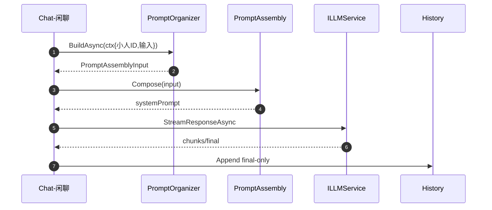
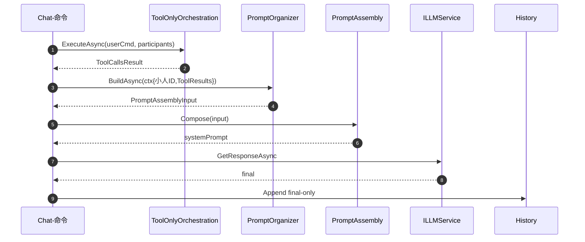
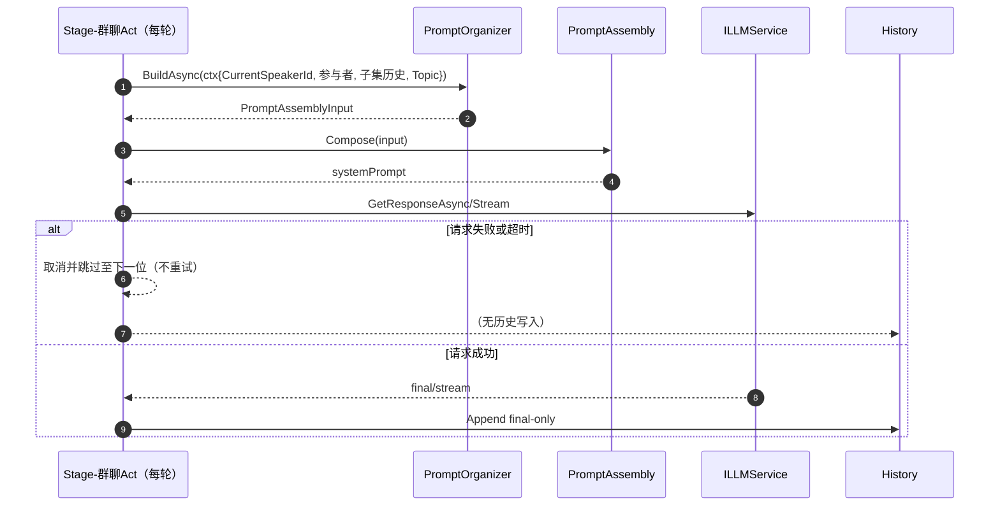

# P12 实施计划：提示词组织者 + Persona 解耦 + 工具仅编排（首版即干净实现）

> 宗旨：冗余全面删除；无旧版本兼容层；职责边界清晰；三条终端链路（Chat-闲聊、Chat-命令、Stage-群聊）“组织者 → 组装器 → 终端发起 LLM/写历史”全闭环。

---

## 0. 背景与原则
- 人格域（Persona）仅做数据：
  - 人格 CRUD、读取、状态导入/导出；
  - 不调用任何其他服务；不负责提示组装与 LLM 请求。
- 提示词组织者（Prompt Organizer）：
  - 位于终端一侧的轻量策略层；只读依赖；产出 `PromptAssemblyInput`；不做网络/写入。
- 工具仅编排（Tool-only Orchestration）：
  - 五步编排不再做最终 LLM 汇总请求，仅做非流式工具规划/执行/聚合，返回 Tool Calls 结果；
  - 最终自然语言输出由终端自行发起 LLM 请求完成。
- 提示组装器（Prompt Assembly）：
  - 唯一入口 `ComposeSystemPromptAsync`（输入驱动）；负责分段裁剪与顺序；
  - 组织者输出的 `PromptAssemblyInput` 进入组装器产出最终 system 提示。
- 历史写入：
  - 始终由终端（UI/Act）负责，仅写入“最终输出”。
- 首版必须“干净”：
  - 删除旧接口与冗余代码；不保留兼容路径；文档、代码、测试与审计同步更新。

---

## 1. 范围与不做什么
- 范围：
  - 删除 Persona 会话服务与所有依赖；
  - 引入提示词组织者（接口、三类实现、配置）；
  - 提示组装器切换为输入驱动的唯一入口；
  - 编排服务改造为“工具仅编排”；
  - 三场景调用规范、审计与段级预算；
  - UI/Stage/Debug 改造；文档与自测；
  - 群聊每轮超时上限与取消机制（新增）。
- 不做：
  - 不引入新增复杂规划/策略（沿用现有工具与配置理念）；
  - 不调整历史/持久化模型（继续“仅最终输出”）。

---

## 2. 架构与接口变更

### 2.1 删除项（强制）
- 删除接口与实现：
  - `RimAI.Core/Source/Modules/Persona/PersonaConversationService.cs`
  - `IPersonaConversationService`（Chat/Command/ChatForStageAsync 全移除）。
- 删除提示组装旧接口：
  - 删除 `IPromptAssemblyService.BuildSystemPromptAsync(...)` 及对应实现/调用。
- 移除注册：
  - `RimAI.Core/Source/Infrastructure/ServiceContainer.cs` 中 `IPersonaConversationService -> PersonaConversationService`。
- 清理引用（编译期强检）：
  - Chat UI：`RimAI.Core/Source/UI/Chat/Parts/MainTabWindow_Chat.Actions.cs`
  - 舞台 Act：`RimAI.Core/Source/Modules/Stage/Acts/GroupChatAct.cs`
  - Debug 面板：`RimAI.Core/Source/UI/DebugPanel/Parts/PromptAuditTestButton.cs` 及所有使用。
- 编排层去 LLM：
  - 移除/替换编排层对 `ILLMService` 的调用与“流式/汇总”相关代码路径。

### 2.2 新增/扩展接口（唯一组装入口）
- `PromptAssemblyInput`（新 DTO，输入驱动）：
  - 字段（可选）：
    - `Mode`：Chat | Command | Stage
    - `Locale`：string
    - `PersonaSystemPrompt`：string
    - `Beliefs`：{ Worldview, Values, CodeOfConduct, TraitsText }
    - `BiographyParagraphs`：List<string>
    - `FixedPromptOverride`：string（会话/回合级 Scenario 文本）
    - `RecapSegments`：List<string>
    - `HistorySnippets`：List<string>
    - `WorldFacts`：List<string>
    - `StageHistory`：List<string>
    - `ToolResults`：List<string>（工具仅编排的结构化结果的可读摘要）
    - `Extras`：List<string>
    - `MaxPromptChars`：int?
- `IPromptAssemblyService`（唯一方法）：
  - `Task<string> ComposeSystemPromptAsync(PromptAssemblyInput input, CancellationToken ct = default)`
- `PromptAssemblyService`：
  - 以“Beliefs → Biography → Persona → FixedPromptOverride → Recap/History → World/Stage → ToolResults → Extras”顺序组装；
  - 应用 `MaxPromptChars` 与段级预算/优先策略；
  - 保留审计日志（段字数/裁剪比/总长）。

### 2.3 提示词组织者（新增）
- `IPromptOrganizer`：
  - `string Name { get; }`
  - `Task<PromptAssemblyInput> BuildAsync(PromptContext ctx, CancellationToken ct = default)`
- `PromptContext`（只读输入）：
  - `Mode`、`ParticipantIds`、`ConvKey?`、`CurrentSpeakerId?`、`PersonaName?`、`PawnId?`、`Locale?`、`ScenarioText?`、`ToolCallResults?`
  - `IncludeFlags`（Persona/Beliefs/Recap/History/World/StageHistory/Tool/Extras 等）、`SegmentBudgets`、`MaxPromptChars`
- `PromptOrganizerConfig`：
  - 段开关、优先级、预算上限、默认顺序、Tool 结果白名单/压缩策略、World 快照字段等。
- 只读依赖清单（组织者允许的依赖）：
  - `IPersonaService`、`IBiographyService`、`IPersonalBeliefsAndIdeologyService`、`IFixedPromptService`、`IHistoryQueryService`、`IRecapService`、`ITopicService`、`IParticipantIdService`、`IWorldDataService`（只读）。
- 禁止：在组织者内发起任何 LLM/编排/写历史/写入持久化。

### 2.4 工具仅编排（新语义）
- 新接口（推荐）：`IToolOrchestrationService`
  - `Task<ToolCallsResult> ExecuteAsync(string userInput, IReadOnlyList<string> participantIds, ToolOrchestrationOptions options = null, CancellationToken ct = default)`
  - 返回：结构化 Tool 调用序列、参数与结果（非流式），不包含 LLM 最终自然语言输出。
- 替代方案（不推荐）：重命名或重写 `IOrchestrationService` 语义为工具仅编排，并删除所有旧流式 API。
- 策略层精简：保留工具匹配/阈值/降级逻辑；去除最终 LLM 汇总阶段；
- 调用关系：终端（命令/Act）→ 工具仅编排（返回 ToolCallsResult）→ 组织者将结果变为 `ToolResults` 段 → 组装器 → 终端发起 LLM → 终端写历史。

### 2.5 典型场景调用规范（三条链路）
- Chat UI（闲聊）：
  - 输入：用户闲聊文本、小人ID。
  - 组织者收集：位置/环境、主线历史、关联历史、历史总结、人格、传记、意识形态、固定提示。
  - 组装：`ComposeSystemPromptAsync`。
  - 请求：UI 调 `ILLMService.StreamResponseAsync`；结束一次性写历史。
- Chat UI（命令）：
  - 输入：用户命令文本、小人ID。
  - 工具仅编排：非流式执行工具链，得到 `ToolCallsResult`。
  - 组织者收集：同闲聊 + `ToolResults`（摘要/白名单/截断）。
  - 组装：`ComposeSystemPromptAsync`。
  - 请求：UI 调 `ILLMService` 获取最终自然语言汇总；结束一次性写历史。
- Stage 群聊 Act：
  - 输入：参与者名单；轮到某小人发言时提供 `CurrentSpeakerId`。
  - 组织者收集：Topic 选题/Scenario、该小人子集历史（排除玩家，仅列表成员子集）、多会话聚合历史、位置/环境、人格/传记/意识形态/固定提示、可选工具结果。
  - 组装：`ComposeSystemPromptAsync`。
  - 请求：Act 调 `ILLMService` 获得本轮发言；Act 写入历史（最终输出）。
  - 失败处理（新增）：
    - 任一轮请求失败（异常/超时/非成功响应）时，不做任何重试，立即跳过到下一位；
    - 本轮不写入历史；
    - 发布 `TurnCompleted` 事件时 `ok=false`，并在 Payload 中提供 `bubbleText="..."` 供 UI 以省略号气泡显示；
    - 记录 Warn 级日志，含 `speakerId` 与错误信息。
  - 超时与取消（新增）：
    - 每轮强制执行超时上限：`MaxLatencyMsPerTurn`（配置项，可调，默认 10000ms，最小 1000ms，最大 30000ms）；
    - 实现方式：为每轮创建 `CancellationTokenSource`，`cts.CancelAfter(MaxLatencyMsPerTurn)`；
    - 行为：一旦超时触发取消，按照“失败处理”一致处理（无重试、无历史、`...` 气泡、Warn 日志），并立即切换至下一位；
    - 要求：不得在取消后继续消费流式分片；需要在 `finally` 中安全释放 CTS/订阅。

---

## 3. 具体改造清单（文件级任务）

### 3.1 Orchestration/Prompt 层
- 新增：`RimAI.Core/Source/Modules/Orchestration/PromptAssemblyModels.cs`
  - 定义 `PromptAssemblyInput`、`BeliefsModel`、段常量与默认预算。
- 修改：`RimAI.Core/Source/Modules/Orchestration/IPromptAssemblyService.cs`
  - 删除 `BuildSystemPromptAsync(...)`；新增唯一签名 `ComposeSystemPromptAsync(...)`。
- 修改：`RimAI.Core/Source/Modules/Orchestration/PromptAssemblyService.cs`
  - 实现 `ComposeSystemPromptAsync`（顺序、裁剪、审计）；
  - 删除旧方法实现与服务侧拉取逻辑。
- 新增（可选）：`PromptAssemblyInputBuilder.cs`（ForChatIdle/ForChatCommand/ForStageGroupChat 预设）。

### 3.2 Prompt Organizer 层（新增目录）
- 新增目录：`RimAI.Core/Source/Modules/Orchestration/PromptOrganizers/`
  - `IPromptOrganizer.cs`、`PromptContext.cs`、`PromptOrganizerConfig.cs`
  - `ChatIdlePromptOrganizer.cs`、`ChatCommandPromptOrganizer.cs`、`StageGroupChatPromptOrganizer.cs`
- 注册：在 `ServiceContainer` 注册三种 Organizer；
- Debug：提供审计路径打印 `PromptAssemblyInput` 与段级统计。

### 3.3 工具仅编排
- 新增接口（Contracts）：`RimAI.Core.Contracts/Orchestration/IToolOrchestrationService.cs`
- 新增实现：`RimAI.Core/Source/Modules/Orchestration/ToolOrchestrationService.cs`
  - 复用现有工具匹配与阈值；移除 LLM 汇总；返回 `ToolCallsResult`。
- 删除/替换：旧 `IOrchestrationService`、`OrchestrationService`、`Strategies/*` 中 LLM 相关代码路径；若保留名称则语义改为工具仅编排并删除流式 API。

### 3.4 UI/Stage/Debug 改造
- Chat UI（`MainTabWindow_Chat.Actions.cs`）：
  - 闲聊：Organizer → Compose → `ILLMService.StreamResponseAsync` → 写历史。
  - 命令：Tool-only 编排 → Organizer（含 ToolResults）→ Compose → `ILLMService` → 写历史。
- Stage `GroupChatAct.cs`：
  - 每轮：Organizer（传 `CurrentSpeakerId`、Topic/Scenario、子集历史）→ Compose → `ILLMService` → 写历史；
  - 失败处理：不重试；不写历史；`TurnCompleted` 事件 Payload 含 `ok=false` 与 `bubbleText="..."`；跳到下一位；
  - 超时与取消：创建 `CancellationTokenSource`，调用 `CancelAfter(Options.MaxLatencyMsPerTurn)`；捕获 `OperationCanceledException` 即按失败处理；释放 CTS；
  - 去除 Persona 会话路径与会话级覆盖写入（优先通过 `ScenarioText` 输入）。
- Debug 面板：
  - `PromptAuditTestButton`：Organizer → Compose 审计，显示段顺序/字数/裁剪比/总长。
  - 工具测试按钮：调用工具仅编排并展示 `ToolCallsResult`。

### 3.5 DI 注册与清理
- `ServiceContainer`：
  - 删除 Persona 会话服务注册；
  - 注册 Organizer、Tool-only 编排服务；
  - 确认组装器唯一入口可用。

---

## 4. 验收 Gate（必须全绿）
- 构建/编译：
  - grep 0：`IPersonaConversationService|PersonaConversationService|BuildSystemPromptAsync`；
  - Orchestration 目录中 grep 不得出现 `ILLMService` 调用；
  - 编译通过，运行稳定。
- 场景联调：
  - Chat-闲聊：流式正常，结束一次性写历史；
  - Chat-命令：工具仅编排 → LLM 汇总 → 写历史；
  - Stage-群聊：
    - 正常回合：Organizer→Compose→LLM→写历史；
    - 失败回合：不重试、跳过到下一位、UI 显示 `...` 气泡、无历史写入、Warn 日志；
    - 超时回合：在 `MaxLatencyMsPerTurn` 内触发取消并按失败回合处理；
- 组织者稳定性：
  - 同一 `PromptContext` 生成的 `PromptAssemblyInput` 哈希稳定（黄金样例）。
- 审计：
  - Debug 面板展示段顺序、段字数、裁剪比、总长与预算对比。
- 性能预算：
  - 组装 < 2ms/次；每帧新增 ≤ 1ms；无 UI 抖动。

---

## 5. 自测与回归
- 黄金样例：
  - `PromptContext` → `PromptAssemblyInput` → `ComposeSystemPromptAsync` 的快照对比测试；
  - 三场景各 3 组样例入库。
- 单元测试：
  - Organizer：IncludeFlags/预算变化下段选择/裁剪一致性；
  - Tool-only 编排：返回结构正确、无 LLM 调用；
  - 组装器：段顺序/优先级/裁剪正确。
- 集成测试：
  - Chat 闲聊/命令、Stage 群聊全链路脚本；
  - Stage 失败回合用例：模拟 LLM 抛错/超时，断言“无重试、UI 显示 `...`、无历史”；
  - Stage 超时用例：将 `MaxLatencyMsPerTurn` 设为 1500ms，模拟慢响应，验证立即取消与跳过；
  - Debug 审计输出校验。

---

## 6. 变更面与风险
- 风险：
  - 组织者耦合上升 → 通过 `PromptOrganizerConfig` 配置化与 `Builder` 统一顺序；
  - Tool 结果过大 → 白名单/Top-K/摘要/截断策略；
  - 历史一致性 → 三链路“仅最终输出写入”用例测试；
  - 观测性不足 → 审计输出段级统计与预算对比；
  - 群聊失败/超时 UI 一致性 → 明确 `bubbleText="..."` 协议，回放可验证。

---

## 7. 时间与任务拆分（建议）

> 目标：仅阅读本节即可按步骤完成实施与联调。每步包含：新增/修改文件、接口签名、注册点、快速自测与验收点。

### D0（0.5 天）输入驱动组装与组织者模型落地
- 新增文件
  - `RimAI.Core/Source/Modules/Orchestration/PromptAssemblyModels.cs`
    - `public enum PromptMode { Chat, Command, Stage }`
    - `public sealed class BeliefsModel { string Worldview, Values, CodeOfConduct, TraitsText }`
    - `public sealed class PromptAssemblyInput { PromptMode Mode; string Locale; string PersonaSystemPrompt; BeliefsModel Beliefs; List<string> BiographyParagraphs; string FixedPromptOverride; List<string> RecapSegments; List<string> HistorySnippets; List<string> WorldFacts; List<string> StageHistory; List<string> ToolResults; List<string> Extras; int? MaxPromptChars; }`
  - `RimAI.Core/Source/Modules/Orchestration/PromptOrganizers/IPromptOrganizer.cs`
    - `public interface IPromptOrganizer { string Name { get; } Task<PromptAssemblyInput> BuildAsync(PromptContext ctx, CancellationToken ct = default); }`
  - `RimAI.Core/Source/Modules/Orchestration/PromptOrganizers/PromptContext.cs`
    - `public sealed class PromptContext { PromptMode Mode; IReadOnlyList<string> ParticipantIds; string ConvKey; string CurrentSpeakerId; string PersonaName; string PawnId; string Locale; string ScenarioText; object ToolCallResults; PromptIncludeFlags IncludeFlags; Dictionary<string,int> SegmentBudgets; int? MaxPromptChars; }`
  - `RimAI.Core/Source/Modules/Orchestration/PromptOrganizers/PromptOrganizerConfig.cs`
    - 含：`EnabledSegments, Priorities, Budgets, MaxPromptChars, WorldSnapshotFields, ToolResultWhitelist`
- 修改文件
  - `RimAI.Core/Source/Modules/Orchestration/IPromptAssemblyService.cs`
    - 删除：`Task<string> BuildSystemPromptAsync(...)`
    - 新增：`Task<string> ComposeSystemPromptAsync(PromptAssemblyInput input, CancellationToken ct = default)`
  - `RimAI.Core/Source/Modules/Orchestration/PromptAssemblyService.cs`
    - 实现 `ComposeSystemPromptAsync`：按顺序组装 + 段级预算/裁剪 + 审计日志
- 注册点
  - 无需注册（接口实现已存在时再补）。
- 快速自测
  - 编译通过；新 DTO/接口可被引用；简单构造 `PromptAssemblyInput` 调用 `ComposeSystemPromptAsync` 返回非空。
- 验收点
  - grep 旧接口 `BuildSystemPromptAsync` 为 0；新增类型与方法签名与文档一致。

### D1（1 天）工具仅编排服务与 DI 注册
- 新增文件
  - `RimAI.Core.Contracts/Orchestration/IToolOrchestrationService.cs`
    - `Task<ToolCallsResult> ExecuteAsync(string userInput, IReadOnlyList<string> participantIds, ToolOrchestrationOptions options = null, CancellationToken ct = default);`
  - `RimAI.Core/Source/Modules/Orchestration/ToolOrchestrationService.cs`
    - 复用工具匹配/执行逻辑；产出 `ToolCallsResult`（结构体：calls[], args, result 摘要等）；不调用 `ILLMService`。
- 修改文件
  - `RimAI.Core/Source/Infrastructure/ServiceContainer.cs`
    - 注册 `IToolOrchestrationService -> ToolOrchestrationService`
  - 移除/改写 `OrchestrationService` 如需保留同名接口，删除流式与最终 LLM 相关路径。
- 快速自测
  - Debug 面板工具测试按钮可调用该服务并打印 `ToolCallsResult`。
- 验收点
  - Orchestration 目录 grep 不出现 `ILLMService`；返回结构化结果且无异常。

### D2（0.5 天）Chat UI（闲聊）改造
- 修改文件
  - `RimAI.Core/Source/UI/Chat/Parts/MainTabWindow_Chat.Actions.cs`
    - 新增：从选择的人格/个性/历史/世界数据构造 `PromptContext(Mode=Chat)`；
    - 调用：`var input = await organizer.BuildAsync(ctx);` → `var sys = await assembler.ComposeSystemPromptAsync(input);`
    - 请求：`ILLMService.StreamResponseAsync`；流结束一次性写历史。
- 注册点
  - `ServiceContainer`：注册默认组织者 `ChatIdlePromptOrganizer`。
- 快速自测
  - 闲聊可流式返回；历史记录仅写最终输出。
- 验收点
  - 相关 UI 操作录屏；Debug 审计可看到段级统计输出。

### D3（0.5–1 天）Chat UI（命令）改造
- 修改文件
  - `MainTabWindow_Chat.Actions.cs`
    - 流程：先 `IToolOrchestrationService.ExecuteAsync` → 注入 `PromptContext.ToolCallResults` → 组织者/组装器 → `ILLMService` 非流式汇总 → 写历史。
- 注册点
  - `ServiceContainer`：注册 `ChatCommandPromptOrganizer`。
- 快速自测
  - 命令模式能拿到工具结果并返回最终总结文本；历史记录仅写最终输出。
- 验收点
  - 录屏展示工具结果→总结→历史入档；Debug 面板能看到 ToolOnly 与 PromptAudit 两段。

### D4（0.5–1 天）Stage 群聊改造（含失败/超时）
- 修改文件
  - `RimAI.Core/Source/Modules/Stage/Acts/GroupChatAct.cs`
    - 每轮：构造 `PromptContext(Mode=Stage, CurrentSpeakerId, ScenarioText=Topic, 子集历史)` → 组织者/组装器 → `ILLMService`；
    - 失败处理：无重试，跳过，`TurnCompleted{ ok=false, bubbleText="..." }`，Warn 日志；
    - 超时：`cts.CancelAfter(cfg.Stage.MaxLatencyMsPerTurn)`，捕获取消按失败处理；释放资源；
    - 不写会话级覆盖（改用 `ScenarioText`）。
- 注册点
  - `ServiceContainer`：注册 `StageGroupChatPromptOrganizer`；确保 `CoreConfig.Stage.MaxLatencyMsPerTurn` 可读。
- 快速自测
  - 正常轮与失败/超时轮均按预期；失败轮 UI 气泡为省略号，且无历史写入。
- 验收点
  - 录屏包含：正常/失败/超时三种回合；Debug 审计输出正确；日志含 Warn。

### D5（0.5 天）Debug/CI/文档与黄金样例
- 修改文件
  - Debug 面板：
    - `PromptAuditTestButton.cs` 改为 Organizer→Compose 审计并输出段级统计（字数/裁剪比/总长）。
    - 工具测试按钮改为调用 `IToolOrchestrationService` 并展示 `ToolCallsResult`。
  - CI/脚本：增加 grep Gate 与黄金样例测试（快照）。
- 快速自测
  - 触发审计与工具测试均正常；grep 检查通过。
- 验收点
  - CI 绿；黄金样例稳定（PromptContext→系统提示 Hash 不变）。

### D6（0.5 天）收尾与提交 Gate
- 执行全链路脚本：闲聊/命令/群聊（含失败/超时）。
- 打包录屏与日志，更新 `ARCHITECTURE_V4.md`、`P10.5`、`P11` 相关章节。
- PR 自检项全部勾选（见“提交与代码审查清单”）。

---

## 8. 提交与代码审查清单
- [ ] 删除 Persona 会话服务及注册；
- [ ] 删除 `BuildSystemPromptAsync` 所有实现与引用；
- [ ] 新增 Organizer 接口/上下文/配置 + 三实现；
- [ ] 组装器：唯一入口 `ComposeSystemPromptAsync` 可用，裁剪/审计完整；
- [ ] 工具仅编排服务可返回结构化结果，Orchestration 目录无 `ILLMService` 调用；
- [ ] Chat（闲聊/命令）、Stage 群聊三链路可跑通并写最终输出；
- [ ] Stage 失败/超时回合：无重试、UI `...` 气泡、无历史写入、Warn 日志；
- [ ] Debug 审计显示段级统计；
- [ ] CI 通过，grep 清单 0；
- [ ] 录屏：Chat-闲聊、Chat-命令、Stage-群聊（含失败/超时回合）、PromptAudit、Tool-only。

---

## 9. 参考调用示例（终端端伪代码）
```csharp
// Chat-命令：工具仅编排 → Organizer → Compose → LLM → 写历史
var toolRes = await Locator.Get<IToolOrchestrationService>()
  .ExecuteAsync(userCmd, participantIds, options, ct);
var ctx = new PromptContext {
  Mode = PromptMode.Command,
  ParticipantIds = participantIds,
  PersonaName = selectedPersona,
  ToolCallResults = toolRes,
  Locale = locale,
  ScenarioText = null,
  IncludeFlags = PromptIncludeFlags.Persona | PromptIncludeFlags.Beliefs | PromptIncludeFlags.Recap | PromptIncludeFlags.History | PromptIncludeFlags.World | PromptIncludeFlags.Tool,
  MaxPromptChars = 4000
};
var input = await Locator.Get<IPromptOrganizer>().BuildAsync(ctx, ct);
var systemPrompt = await Locator.Get<IPromptAssemblyService>().ComposeSystemPromptAsync(input, ct);
var req = new UnifiedChatRequest {
  Stream = false,
  Messages = new List<ChatMessage>{
    new ChatMessage{ Role = "system", Content = systemPrompt },
    new ChatMessage{ Role = "user", Content = userCmd }
  }
};
var summary = await Locator.Get<ILLMService>().GetResponseAsync(req, ct);
// 终端一次性写入历史（最终输出）
```

---

## 10. Mermaid：三场景序列图






---

## 11. 配置与术语
- `CoreConfig.PromptOrganizer`：`EnabledSegments`、`Priorities`、`Budgets`、`MaxPromptChars`、`WorldSnapshotFields`、`ToolResultWhitelist`。
- `CoreConfig.Stage.MaxLatencyMsPerTurn`：群聊每轮最大允许时延（默认 10000ms；范围 1000–30000ms）；小于下限时按下限处理。
- 术语统一：提示词组织者（Prompt Organizer）/ 提示组装（Compose）/ 工具仅编排（Tool-only Orchestration）。

---

## 12. 文档更新点（提交时同步）
- `docs/ARCHITECTURE_V4.md`
  - 第 5.8/5.8.1：移除 Persona 会话服务；补充“终端扁平接入 + 组织者”；
  - 第 5.9：策略层去最终 LLM 汇总，转为工具仅编排；
  - 第 5.10/5.11：提示组装切换为输入驱动（Compose 唯一入口），与个性化关系保持不变；
  - 新增 `Stage.MaxLatencyMsPerTurn` 配置说明。
- `docs/P10.5_IMPLEMENTATION_PLAN.md`、`docs/P11_IMPLEMENTATION_PLAN.md`
  - 时序图切换为“终端 → Organizer → Compose → LLM/历史”；命令链路增加工具仅编排阶段；
  - 在 Stage 部分补充“每轮超时与取消机制”。

> 以上为首版落地的全部改造与验收条款。按本计划实施后：Persona 域职责单一；三场景通过“组织者 → 组装器 → 终端发起 LLM/写历史”闭环；编排职责聚焦工具；群聊失败/超时回合“无重试/省略号气泡/无历史/取消”可被稳定验证；系统更易构思、组织与管理。
