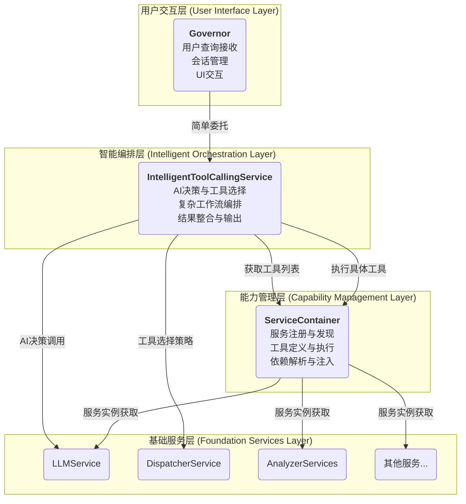
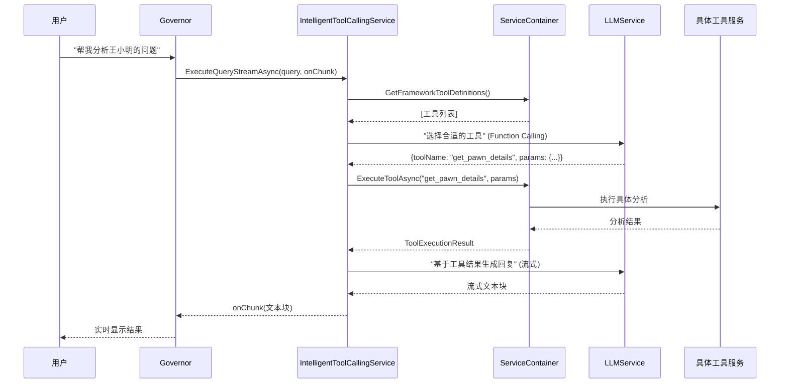

# [最终设计] AI工具调用架构 - v3.0 (2025-07-24)

> **版本说明**: 本文档描述了AI工具调用功能的最终架构设计。该设计将 ServiceContainer 升级为统一的"能力中心"，将 IntelligentToolCallingService 定位为"智能编排引擎"，实现更清晰的职责分离和更强大的扩展能力。

## 🎯 设计目标 (Goals)

### 主要目标
1. **统一能力管理**: ServiceContainer 成为所有服务、工具、函数的统一注册和执行中心
2. **智能工作流编排**: IntelligentToolCallingService 专注于复杂的 AI-工具交互流程
3. **清晰职责边界**: 每个组件都有明确、单一的职责，避免功能重叠
4. **面向未来扩展**: 支持工具链、并行调用、条件分支等高级场景

### 核心原则
- **ServiceContainer**: 管理"能力"，不管理"流程"
- **IntelligentToolCallingService**: 管理"智能编排"，不管理"工具执行"
- **Governor**: 管理"用户交互"，不管理"底层逻辑"

## 🌊 新架构概览 (Architecture Overview)

### 分层职责图


### 核心工作流程


## 🏗️ 详细组件设计

### 1. ServiceContainer - 统一能力中心

#### 核心职责
- **服务生命周期管理**: 注册、获取、销毁所有服务实例
- **工具定义管理**: 注册、发现、验证所有可执行工具
- **工具执行引擎**: 参数验证、类型转换、方法调用、结果处理
- **依赖解析**: 自动解析服务间依赖关系

#### 关键接口设计
```csharp
public class ServiceContainer
{
    // === 服务管理 (现有功能) ===
    public T GetService<T>() where T : class;
    public void RegisterService<TInterface, TImplementation>(TImplementation instance);
    
    // === 工具管理 (新增功能) ===
    public void RegisterServiceWithTools<TInterface, TImplementation>(
        TImplementation implementation,
        params ExecutableToolBuilder<TInterface>[] toolBuilders);
    
    public List<FrameworkAITool> GetFrameworkToolDefinitions();
    public async Task<ToolExecutionResult> ExecuteToolAsync(string toolName, Dictionary<string, object> parameters);
    
    // === 能力查询 (新增功能) ===
    public bool HasTool(string toolName);
    public ExecutableTool GetToolDefinition(string toolName);
    public List<string> GetToolsForService<T>();
}
```

#### 工具注册示例
```csharp
private void RegisterDefaultServices()
{
    // 注册分析服务及其工具
    RegisterServiceWithTools<IColonyAnalyzer, ColonyAnalyzer>(
        new ColonyAnalyzer(),
        
        ExecutableToolBuilder<IColonyAnalyzer>
            .Create("get_colony_summary", "获取殖民地整体状况概览")
            .WithImplementation(async (analyzer, params) => 
                await analyzer.GetQuickStatusSummaryAsync()),
                
        ExecutableToolBuilder<IColonyAnalyzer>
            .Create("analyze_colony_mood", "分析殖民地整体心情状态")
            .WithParameter("detailed", "boolean", "是否返回详细分析", false, true)
            .WithImplementation(async (analyzer, params) => 
                await analyzer.AnalyzeMoodAsync((bool)params.GetValueOrDefault("detailed", true)))
    );
    
    RegisterServiceWithTools<IPawnAnalyzer, PawnAnalyzer>(
        new PawnAnalyzer(),
        
        ExecutableToolBuilder<IPawnAnalyzer>
            .Create("get_pawn_details", "获取指定殖民者详细信息")
            .WithParameter("pawnName", "string", "殖民者姓名", true)
            .WithParameter("includeSkills", "boolean", "包含技能信息", false, true)
            .WithImplementation(async (analyzer, params) =>
            {
                var name = (string)params["pawnName"];
                var includeSkills = (bool)params.GetValueOrDefault("includeSkills", true);
                return await analyzer.GetPawnDetailsAsync(name, includeSkills);
            })
    );
}
```

### 2. IntelligentToolCallingService - 智能编排引擎

#### 核心职责
- **AI交互管理**: 与LLM进行多轮对话，处理Function Calling
- **工作流编排**: 单工具、工具链、并行工具、条件分支等复杂场景
- **上下文管理**: 维护对话上下文，处理工具间数据传递
- **结果整合**: 将多个工具结果整合成用户友好的最终回复
- **流式输出**: 管理实时的用户反馈和进度显示

#### 关键接口设计
```csharp
public interface IIntelligentToolCallingService
{
    // === 基础能力 ===
    Task ExecuteQueryStreamAsync(string query, Action<string> onChunk, CancellationToken cancellationToken = default);
    Task<string> ExecuteQueryAsync(string query, CancellationToken cancellationToken = default);
    
    // === 高级能力 (未来扩展) ===
    Task ExecuteToolChainStreamAsync(string query, Action<string> onChunk, ToolChainOptions options = null, CancellationToken cancellationToken = default);
    Task ExecuteParallelToolsStreamAsync(string query, Action<string> onChunk, ParallelToolOptions options = null, CancellationToken cancellationToken = default);
    
    // === 规划能力 (调试支持) ===
    Task<ExecutionPlan> PlanExecutionAsync(string query, CancellationToken cancellationToken = default);
}
```

#### 执行策略
```csharp
public enum ExecutionStrategy
{
    SimpleConversation,  // 无需工具，直接对话
    SingleTool,          // 单工具执行
    SequentialTools,     // 顺序执行多个工具
    ParallelTools,       // 并行执行多个工具
    ConditionalFlow,     // 基于结果的条件分支
    IterativeRefinement  // 迭代优化（多轮工具调用）
}
```

#### 高级工作流示例（⚠️警告，目前不要尝试实施，这会导致原始版本过于复杂，Bug增多，在没有授权的情况下，任何人、任何AI都不得实施这部分内容，这部分仅供展示、讨论！！！再三注意！⚠️）
```csharp
// 工具链执行：分析问题 → 查找解决方案 → 生成建议
public async Task ExecuteToolChainStreamAsync(string query, Action<string> onChunk, ToolChainOptions options = null, CancellationToken cancellationToken = default)
{
    // 1. AI规划阶段
    onChunk?.Invoke("🤔 正在分析您的请求并制定执行计划...\n");
    var plan = await PlanExecutionAsync(query, cancellationToken);
    onChunk?.Invoke($"📋 执行计划：{plan.Strategy}，共{plan.Steps.Count}个步骤\n\n");

    // 2. 顺序执行阶段
    var context = new WorkflowContext();
    foreach (var step in plan.Steps)
    {
        onChunk?.Invoke($"🔧 执行步骤{step.Number}：{step.Purpose}\n");
        
        // 使用前面步骤的结果丰富当前步骤的参数
        var enrichedParams = EnrichParametersWithContext(step.Parameters, context);
        
        // 执行工具
        var result = await CoreServices.ExecuteToolAsync(step.ToolName, enrichedParams);
        if (result.Success)
        {
            context.AddStepResult(step.Number, result.Result);
            onChunk?.Invoke($"✅ 步骤{step.Number}完成\n");
        }
        else
        {
            onChunk?.Invoke($"❌ 步骤{step.Number}失败：{result.ErrorMessage}\n");
            // 错误恢复逻辑
            await HandleStepFailure(step, result, context, onChunk, cancellationToken);
        }
    }

    // 3. 结果整合阶段
    onChunk?.Invoke("\n📝 正在整合分析结果...\n");
    await GenerateComprehensiveResponse(query, context, onChunk, cancellationToken);
}
```

### 3. Governor - 用户交互入口

#### 核心职责
- **查询接收**: 接收用户的自然语言查询
- **简单委托**: 将复杂逻辑委托给IntelligentToolCallingService
- **会话管理**: 维护与用户的对话状态
- **结果转发**: 将处理结果转发给用户界面

#### 简化后的实现
```csharp
public class Governor : OfficerBase
{
    private readonly IIntelligentToolCallingService _toolCallingService;

    public Governor()
    {
        _toolCallingService = CoreServices.IntelligentToolCalling;
    }

    public async Task HandleUserQueryStreamAsync(string userQuery, Action<string> onChunk, CancellationToken cancellationToken = default)
    {
        if (_toolCallingService == null)
        {
            onChunk?.Invoke("智能工具调用服务暂时不可用。");
            return;
        }
        
        // 简单委托，所有复杂逻辑由 IntelligentToolCallingService 处理
        await _toolCallingService.ExecuteQueryStreamAsync(userQuery, onChunk, cancellationToken);
    }

    public async Task<string> HandleUserQueryAsync(string userQuery, CancellationToken cancellationToken = default)
    {
        if (_toolCallingService == null)
        {
            return "智能工具调用服务暂时不可用。";
        }
        
        return await _toolCallingService.ExecuteQueryAsync(userQuery, cancellationToken);
    }
}
```

## 🔧 技术实现要点

### 1. 避免与Framework冲突
- **类型命名区分**: `ExecutableTool` (Core) vs `AITool` (Framework)
- **职责清晰分离**: Framework负责AI接口，Core负责执行逻辑
- **兼容性保证**: Core的工具可以转换为Framework的AITool格式

### 2. 类型安全保证
```csharp
// 编译时类型检查
ExecutableToolBuilder<IPawnAnalyzer>
    .Create("get_pawn_details", "获取殖民者信息")
    .WithParameter("pawnName", "string", "殖民者姓名", required: true)
    .WithImplementation(async (analyzer, params) => 
    {
        // 这里有完整的类型安全保证
        var name = (string)params["pawnName"]; // 参数验证已在框架层完成
        return await analyzer.GetPawnDetailsAsync(name);
    });
```

### 3. 错误处理和恢复
```csharp
public class ToolExecutionResult
{
    public bool Success { get; set; }
    public string Result { get; set; }
    public string ErrorMessage { get; set; }
    public TimeSpan ExecutionTime { get; set; }
    public Dictionary<string, object> Metadata { get; set; }
    
    public static ToolExecutionResult Success(string result, TimeSpan? duration = null) => new() { Success = true, Result = result, ExecutionTime = duration ?? TimeSpan.Zero };
    public static ToolExecutionResult Error(string error) => new() { Success = false, ErrorMessage = error };
    public static ToolExecutionResult NotFound(string toolName) => new() { Success = false, ErrorMessage = $"工具 '{toolName}' 未找到" };
}
```

### 4. 统一LLM调用网关 (新增原则)
- **原则**: `Core` 模块内部所有对大语言模型的调用，**必须**通过 `Core` 自己的 `ILLMService` 接口进行。
- **禁止**: 任何服务（包括 `IntelligentToolCallingService`）都不应直接调用 `RimAI.Framework.API.RimAIApi`。
- **理由**:
    - **统一控制点**: 允许我们在 `Core` 层面添加统一的日志、缓存、监控或请求/响应拦截逻辑。
    - **解耦**: 使 `Core` 模块与 `Framework` 的具体实现解耦，未来即使 `Framework` API变更，我们也只需修改 `Core.LLMService` 的实现，而不用修改所有调用点。
    - **职责清晰**: `Core.LLMService` 作为 `Core` 模块访问 `Framework` LLM能力的**唯一**网关。

```csharp
// 正确的调用方式 (在 IntelligentToolCallingService 中)
public class IntelligentToolCallingService : IIntelligentToolCallingService
{
    private readonly ILLMService _llmService;

    public IntelligentToolCallingService()
    {
        // 从CoreServices获取Core自己的LLM服务
        _llmService = CoreServices.LLMService; 
    }

    private async Task SomeMethod()
    {
        // ✅ 必须通过 Core 的服务接口调用
        await _llmService.SendStreamingMessageAsync(...); 
    }
}

// 错误的调用方式
public class SomeOtherService
{
    private async Task SomeMethod()
    {
        // ❌ 禁止直接调用 Framework 的静态 API
        await RimAIApi.SendMessageStreamAsync(...); 
    }
}
```

### 5. 架构简化决策：移除Dispatcher层 (新增决策)
- **问题分析**: 经过审查，`IDispatcherService` 抽象层当前唯一的有效实现是 `LlmToolDispatcherService`，而 `EmbeddingDispatcherService` 只是一个未实现的占位符。这使得 `Dispatcher` 层成为了一个多余的中间层。
- **核心决策**: **完全移除 `IDispatcherService` 抽象层及其所有实现** (`LlmToolDispatcherService`, `EmbeddingDispatcherService`)。
- **职责转移**: 原本由 `LlmToolDispatcherService` 负责的“调用LLM进行工具选择”的职责，将**直接由 `IntelligentToolCallingService` 承担**。
- **理由**:
    - **简化架构**: 减少不必要的抽象和文件，降低认知负荷。
    - **提升内聚性**: `IntelligentToolCallingService` 作为“智能编排引擎”，自己负责与LLM沟通来制定执行计划，是完全合理的。
    - **遵循YAGNI原则**: “You Ain't Gonna Need It”。我们不应该为一个当前不存在的需求（多种工具选择策略）保留一个抽象层。

```csharp
// 简化后的 IntelligentToolCallingService
public class IntelligentToolCallingService : IIntelligentToolCallingService
{
    private readonly ILLMService _llmService;

    public IntelligentToolCallingService()
    {
        _llmService = CoreServices.LLMService; 
    }

    public async Task ExecuteQueryStreamAsync(string query, Action<string> onChunk, CancellationToken cancellationToken = default)
    {
        var availableTools = CoreServices.GetAvailableTools();
        
        // 职责内化：直接调用 LLMService 进行工具选择
        var functionCalls = await _llmService.GetFunctionCallAsync(query, availableTools, cancellationToken);
        
        // ... 后续的工具执行和响应生成逻辑 ...
    }
}
```

## 📝 实施计划 (Implementation Plan)

### 阶段1：ServiceContainer增强 (优先级：高)
1. **扩展ServiceContainer**
   - 添加工具注册API (`RegisterServiceWithTools`)
   - 实现工具执行引擎 (`ExecuteToolAsync`)
   - 添加工具发现API (`GetFrameworkToolDefinitions`)

2. **创建工具定义系统**
   - 实现 `ExecutableTool` 和 `ExecutableToolBuilder`
   - 实现参数验证和类型转换
   - 添加与Framework的兼容层

3. **迁移现有工具注册**
   - 将 `ToolRegistryService` 中的工具定义迁移到新系统
   - 更新服务注册方式
   - 确保向后兼容

### 阶段2：IntelligentToolCallingService重构 (优先级：高)
1. **简化当前实现**
   - 移除对 `IToolRegistryService` 的依赖
   - 直接使用 `ServiceContainer` 的工具能力
   - 优化错误处理和用户反馈

2. **添加高级编排能力**
   - 实现工具链执行 (`ExecuteToolChainStreamAsync`)
   - 实现并行工具调用 (`ExecuteParallelToolsStreamAsync`)
   - 添加执行计划功能 (`PlanExecutionAsync`)

### 阶段3：清理和优化 (优先级：中)
1. **移除冗余组件**
   - 删除 `IToolRegistryService` 和 `ToolRegistryService`
   - 更新 `CoreServices` 门面
   - 清理相关的using语句和依赖

2. **更新文档和示例**
   - 更新开发者指南
   - 更新API参考文档
   - 添加高级使用示例

### 阶段4：测试和验证 (优先级：中)
1. **功能测试**
   - 单工具调用测试
   - 工具链调用测试
   - 并行工具调用测试
   - 错误处理测试

2. **性能优化**
   - 工具执行性能优化
   - 内存使用优化
   - 并发处理优化

## 🌟 架构优势

### 1. 清晰的职责分离
- **ServiceContainer**: 专注于"能力管理"，不涉及"流程编排"
- **IntelligentToolCallingService**: 专注于"智能编排"，不涉及"工具执行"
- **Governor**: 专注于"用户交互"，不涉及"底层逻辑"

### 2. 强大的扩展能力
- **新工具添加**: 只需在服务注册时添加工具定义
- **新编排策略**: 只需在IntelligentToolCallingService中添加新方法
- **新AI官员**: 可以复用整个工具调用基础设施

### 3. 优秀的开发体验
- **类型安全**: 编译时就能发现工具定义错误
- **自动补全**: IDE能够提供完整的代码补全
- **易于调试**: 清晰的执行流程和详细的日志
- **易于测试**: 每个组件都有明确的接口和职责

### 4. 面向未来
- **工具链支持**: 支持复杂的多步骤任务处理
- **并行处理**: 支持同时执行多个工具
- **条件分支**: 支持基于结果的动态决策
- **迭代优化**: 支持多轮交互和结果改进

---

## 施工提示词 (Implementation Prompt)

**任务：** 根据上述 v3.0 架构设计，对 `RimAI.Core` 进行全面重构。

**核心原则：**
1. **ServiceContainer为能力中心**: 统一管理所有服务和工具，提供执行能力
2. **IntelligentToolCallingService为编排引擎**: 处理复杂的AI-工具交互流程
3. **避免Framework冲突**: 使用不同的类型名称和明确的职责边界
4. **保持向后兼容**: 在可能的情况下保持现有API的兼容性

**具体实施步骤：**

1. **扩展ServiceContainer**：
   - 添加 `ExecutableTool` 和 `ExecutableToolBuilder` 类
   - 实现 `RegisterServiceWithTools` 方法
   - 实现 `ExecuteToolAsync` 方法
   - 实现 `GetFrameworkToolDefinitions` 方法

2. **重构IntelligentToolCallingService**：
   - 移除对 `IToolRegistryService` 的依赖
   - 使用 `ServiceContainer` 的新API
   - 保持现有的 `ExecuteQueryStreamAsync` 方法
   - 为未来的高级功能预留接口

3. **更新服务注册**：
   - 将现有的工具定义迁移到新的注册方式
   - 保持所有服务的正常注册和运行

4. **清理工作**：
   - 移除 `IToolRegistryService` 及其实现
   - 更新 `CoreServices` 门面
   - 更新相关的依赖和引用

5. **验证和测试**：
   - 确保所有现有功能正常工作
   - 验证新的工具注册和执行机制
   - 确保 Governor 能够正常处理用户查询 