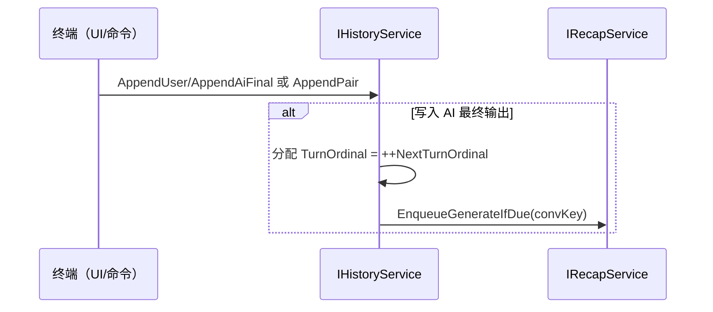
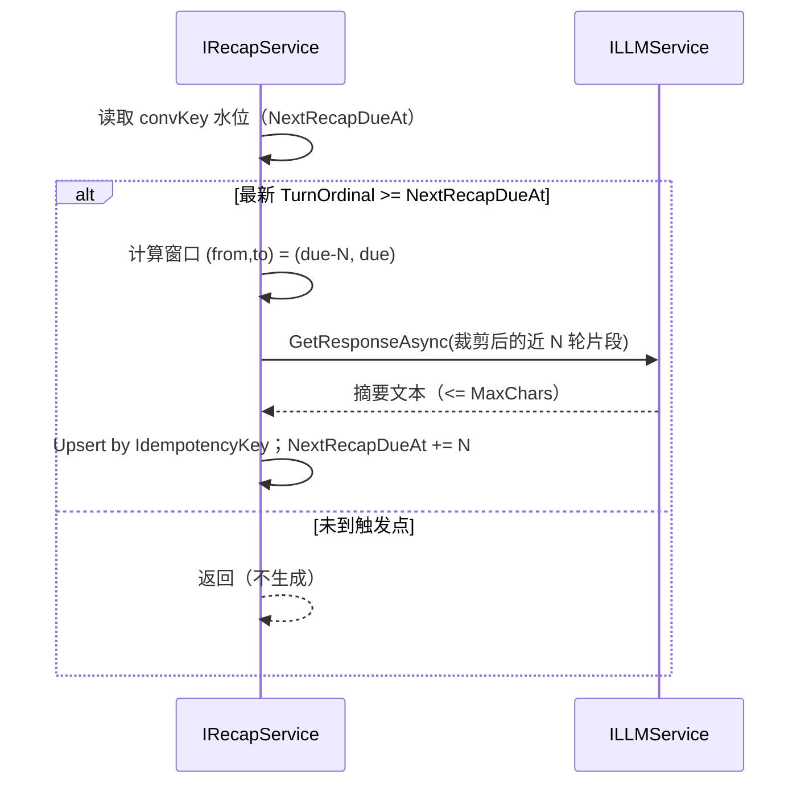
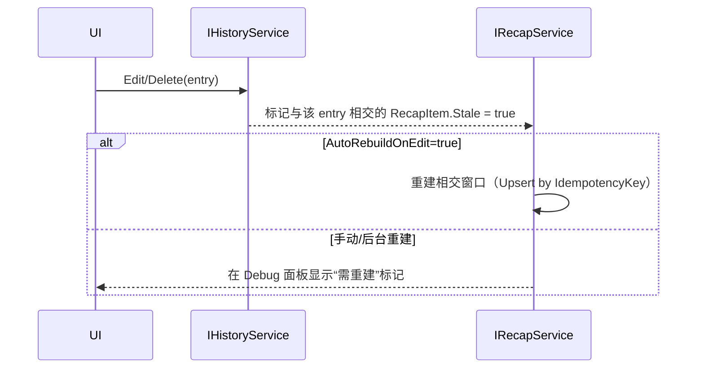
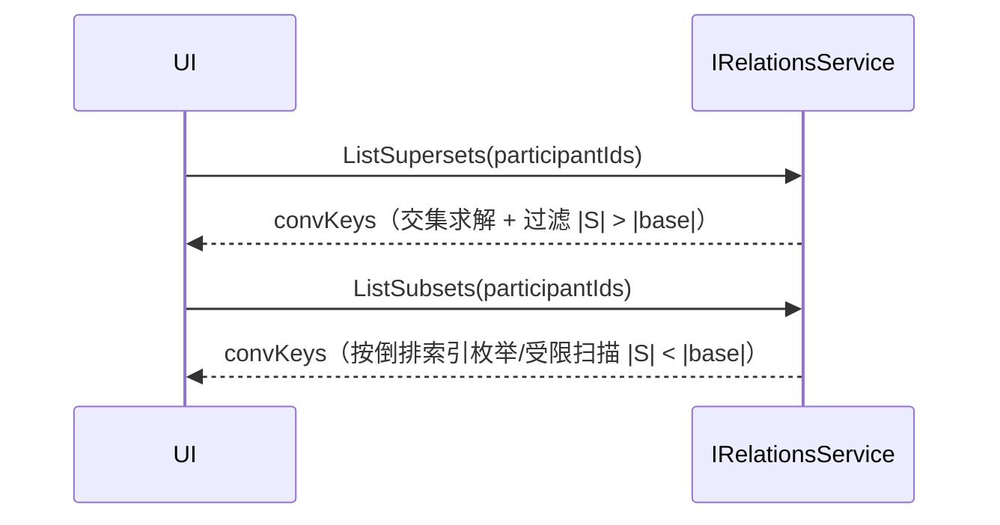

# RimAI V5 — P8 实施计划（History：历史 / 前情提要 / 关联对话）

> 目标：一次性交付“历史域”的最小而完整闭环，包含三类服务：历史记录（History）、前情提要（Recap）、关联对话（Relations）。本文件为唯一入口，无需查阅旧文即可实施与验收。

---

## 0. 范围与非目标

- 范围（本阶段交付）
  - 历史记录：仅记录终端“最终输出”（用户输入 + AI 最终自然语言回复或命令模式最终汇总），不保存中间过程（工具调用/流式分片/规划）。
  - 前情提要：按 N 轮触发自动生成，支持“覆盖（Replace）/累加（Append）”两种模式；每条有最大字数限制；允许查询/单条编辑/单条删除。
  - 关联对话：围绕参与者集合，返回严格超集/严格子集的对话会话列表，支持分页与排序。
  - 展示层“ID→显示名”解析（避免直接露内部 ID），可缓存与热修正。

- 非目标（后续阶段处理）
  - 不实现 Stage/Act/Kernel/事件聚合；不引入编排策略/RAG；不负责最终 LLM 汇总（由终端完成）。
  - 不改变 Contracts 对外最小面；不将 Verse/Scribe 扩散至历史域实现之外（持久化层独占 Scribe）。

---

## 1. 设计原则与边界

- 单一主键：`convKey = join('|', sort(participantIds))`（顺序无关、全局唯一）。
- 不记录中间过程：只保留“用户输入 / AI 最终输出”。
- 线程与引擎边界：任何 Verse 访问仅通过 `IWorldDataService` 且由 `ISchedulerService` 主线程化；历史域自身不 `using Verse`。
- LLM 边界：Recap 生成一律走 `ILLMService.GetResponseAsync`（非流式），尊重 P2 超时/重试/断路器；后台/服务型调用不启用流式。
- 持久化边界：Scribe 只在 `IPersistenceService`；历史域仅导入/导出快照 POCO。
- 展示一致性：展示层永远显示“游戏内显示名”，不显示内部 ID。

---

## 2. 键与索引（核心）

- 主键（唯一）：`convKey`（参与者集合排序后 `|` 连接）。
- 倒排索引（内存）：`participantId → HashSet<convKey>`，用于：
  - 按参与者列举会话、计算严格超集（交集求解）。
- 附加短键：`convKeyHash → convKey`（64 位短键）仅用于热路径定位；落盘仍使用 `convKey`。
- 元数据缓存：`convKey → participants[]`（便于子集判断、展示名解析）。

---

## 3. 服务与职责

### 3.1 IHistoryService（历史记录）

职责：
- 维护按 `convKey` 的对话流水（仅最终输出）。
- 维护“单调回合序号与门限水位”（见 §6 风险解法），在写入 AI 最终输出后推进回合并触发 Recap 生成调度。
- 提供查询/分页、单条编辑、单条删除/撤销。

能力：
```csharp
internal interface IHistoryService {
  // 写入（终端完成一次交互后调用）
  // 允许一次性追加成对记录，或分两次调用 AppendUser / AppendAiFinal
  Task AppendPairAsync(string convKey, string userText, string aiFinalText, CancellationToken ct = default);
  Task AppendUserAsync(string convKey, string userText, CancellationToken ct = default);
  Task AppendAiFinalAsync(string convKey, string aiFinalText, CancellationToken ct = default);

  // 查询（分页）
  Task<HistoryThread> GetThreadAsync(string convKey, int page = 1, int pageSize = 100, CancellationToken ct = default);

  // 单条编辑 / 删除 / 撤销
  Task<bool> EditEntryAsync(string convKey, string entryId, string newContent, CancellationToken ct = default);
  Task<bool> DeleteEntryAsync(string convKey, string entryId, CancellationToken ct = default); // 软删 + 撤销窗口
  Task<bool> RestoreEntryAsync(string convKey, string entryId, CancellationToken ct = default);

  // 事件（供 Debug/后台订阅）
  event Action<string /*convKey*/, string /*entryId*/> OnEntryRecorded;
}
```

### 3.2 IRecapService（前情提要）

职责：
- 在历史写入时按策略触发摘要生成；支持 Replace/Append 两模式；每条摘要长度受限；允许查询/单条编辑/删除。
- 维护“桶窗口与幂等键”，避免重复生成；处理编辑/删除导致的摘要“过期重建”。

能力：
```csharp
internal enum RecapMode { Replace, Append }

internal interface IRecapService {
  // 生成调度（由 History 调用或 Debug 手动触发）
  Task EnqueueGenerateIfDueAsync(string convKey, CancellationToken ct = default);
  Task ForceRebuildAsync(string convKey, CancellationToken ct = default);

  // 查询 / 编辑 / 删除
  IReadOnlyList<RecapItem> GetRecaps(string convKey);
  bool UpdateRecap(string convKey, string recapId, string newText);
  bool DeleteRecap(string convKey, string recapId);

  // 快照（持久化）
  RecapSnapshot ExportSnapshot();
  void ImportSnapshot(RecapSnapshot snapshot);

  event Action<string /*convKey*/, string /*recapId*/> OnRecapUpdated;
}
```

### 3.3 IRelationsService（关联对话）

职责：
- 基于 `participantId → Set<convKey>` 倒排索引，为传入参与者集合返回：
  - 严格超集（包含该集合且参与者更多的会话）。
  - 严格子集（被该集合严格包含的会话）。
- 默认排序：集合大小差值升序 → 最近活跃时间降序；支持分页。

能力：
```csharp
internal interface IRelationsService {
  Task<RelationResult> ListSupersetsAsync(IReadOnlyList<string> participantIds, int page, int pageSize, CancellationToken ct = default);
  Task<RelationResult> ListSubsetsAsync(IReadOnlyList<string> participantIds, int page, int pageSize, CancellationToken ct = default);
  Task<IReadOnlyList<string>> ListByParticipantAsync(string participantId, CancellationToken ct = default); // 直接列举其参与过的 convKey
}
```

---

## 4. 数据模型（POCO，仅内部）

```csharp
internal enum EntryRole { User, Ai }

internal sealed class HistoryEntry {
  public string Id { get; init; }
  public EntryRole Role { get; init; }
  public string Content { get; set; }
  public DateTime Timestamp { get; init; }
  public bool Deleted { get; set; }
  public long? TurnOrdinal { get; init; } // 仅 AI 最终输出持有“单调回合序号”
}

internal sealed class HistoryThread {
  public string ConvKey { get; init; }
  public IReadOnlyList<HistoryEntry> Entries { get; init; }
  public int Page { get; init; }
  public int PageSize { get; init; }
  public int TotalEntries { get; init; }
}

internal sealed class RecapItem {
  public string Id { get; init; }
  public string ConvKey { get; init; }
  public RecapMode Mode { get; init; }
  public string Text { get; set; }
  public int MaxChars { get; init; }
  public long FromTurnExclusive { get; init; } // 覆盖窗口（基于单调回合序号）
  public long ToTurnInclusive { get; init; }
  public bool Stale { get; set; }              // 历史编辑/删除导致的潜在失真
  public string IdempotencyKey { get; init; }  // = hash(convKey, Mode, FromTurnExclusive, ToTurnInclusive, strategyVersion)
  public DateTime CreatedAt { get; init; }
  public DateTime UpdatedAt { get; set; }
}

internal sealed class RelationResult {
  public IReadOnlyList<string> ConvKeys { get; init; }
  public int Page { get; init; }
  public int PageSize { get; init; }
  public int Total { get; init; }
}
```

---

## 5. 展示层：显示名解析（避免直接露 ID）

- `IDisplayNameService`：
  - `Task<Dictionary<string,string>> ResolveAsync(IReadOnlyList<string> participantIds)`
  - 通过 `IWorldDataService` 在主线程安全读取，带 LRU 缓存；当 Pawn 改名/离场时下次刷新修正。
- 历史域不在持久化中保存显示名；渲染时绑定（避免存档漂移）。

---

## 6. 风险与关键决策：删除后的计数器与重复生成

问题：若“回合计数器（Counter）”在删除记录时回退，将在达到阈值 N 后再次触发同一窗口的前情提要，造成重复。

解决方案（推荐，默认启用）：“单调回合序号 + 水位门限 + 幂等键”

1) 单调回合序号（TurnOrdinal）
   - 仅在写入“AI 最终输出”时为该条目分配 `TurnOrdinal = ++NextTurnOrdinal`。
   - 该序号单调递增，删除或编辑不回退、不重排。

2) 门限水位（Watermark）
   - 维护 `NextRecapDueAt`（初始为 N，随后每次 += N）。
   - 当最新 AI 条目的 `TurnOrdinal >= NextRecapDueAt` 时，进入“应生成”分支：
     - 计算窗口：`(from = NextRecapDueAt - N, to = NextRecapDueAt)`。
     - 生成/更新摘要后，将 `NextRecapDueAt += N`。循环判定可一次处理多桶。
   - 删除历史不回退 `NextRecapDueAt`，因此不会重复触发既往窗口。

3) 幂等键（IdempotencyKey）
   - 摘要条目持有 `IdempotencyKey = hash(convKey, mode, from, to, strategyVersion)`。
   - 生成时采用 Upsert：如发现相同键存在则更新（Replace 模式覆盖、Append 模式忽略或合并可配置），从源头避免重复。

4) 编辑/删除的影响与“过期（Stale）”
   - 任一历史条目被编辑/删除后，标记与其覆盖窗口相交的 RecapItem 为 `Stale=true`；
   - 不回退 Counter/水位，避免重复生成；
   - 后台“重建队列”或 Debug 面板“Rebuild”可按需重算这些窗口，Upsert 覆盖旧条目；
   - 可选配置：`AutoRebuildOnEdit=true/false`（默认 false，避免频繁 LLM 费用）。

此方案满足“删除不回退 Counter，避免重复生成”，同时通过 `Stale+Rebuild` 保持内容一致性。

---

## 7. 摘要模式（Replace vs Append）

- Replace（覆盖）：
  - 始终维护“单条滚动摘要”，覆盖窗口为“最近 N 轮”（或配置的滚动窗口）。
  - 每次触发将同一 `IdempotencyKey` 的 RecapItem 覆盖更新（尾随窗口移动）。
  - 用途：轻量“最近进展”提示。

- Append（累加）：
  - 将每个 N 轮窗口作为一个固定“桶”，追加为新 `RecapItem`（`from=prev, to=prev+N`）。
  - 允许列表编辑/重排/删除；编辑/删除后标记相交桶为 `Stale`。
  - 用途：长期滚动档案。

> 两模式可在配置中切换，但建议会话内保持一致；切换时采用“从当前水位开始”新策略，旧条目保留或批量转换可通过 Debug 工具执行。

---

## 8. 配置（内部 CoreConfig.History）

```json
{
  "History": {
    "SummaryEveryNRounds": 5,
    "Recap": {
      "Mode": "Append",           // Replace | Append
      "MaxChars": 1200,            // 每条摘要最大字数（超出裁剪并审计）
      "AutoRebuildOnEdit": false   // 历史编辑/删除后自动重建相交摘要
    },
    "PageSize": 100,
    "UndoWindowSeconds": 3,
    "Budget": { "MaxLatencyMs": 5000 },
    "DisplayNameCacheSize": 256
  }
}
```

说明：配置为内部消费，通过 `IConfigurationService` 读取；保存后热生效。

---

## 9. 目录结构与文件（建议）

```text
RimAI.Core/
  Source/
    Modules/
      History/
        IHistoryService.cs
        HistoryService.cs              // 写入/查询/编辑/删除 + 水位推进 + 事件
        Recap/
          IRecapService.cs
          RecapService.cs              // 调度/生成/幂等/重建 + 策略
        Relations/
          IRelationsService.cs
          RelationsService.cs          // 超集/子集查询（倒排索引）
        Models/
          HistoryModels.cs             // Entry/Thread/Recap/Relation POCO
        View/
          DisplayNameAdapter.cs        // ID→显示名绑定（依赖 IDisplayNameService）
    UI/DebugPanel/Parts/
      P8_HistoryPanel.cs              // 历史分页/编辑/删除/撤销；Recap 预览/重建；关联列表
```

---

## 10. 流程与状态机

### 10.1 写入与水位推进



### 10.2 Recap 生成（Append 模式示例）



### 10.3 编辑/删除与“过期”



### 10.4 关联对话（严格超集/子集）



---

## 11. Recap 提示模板（示例）

> 由 `RecapService` 内置最小模板（可本地化），输入为近 N 轮“用户/AI 最终输出”片段，输出短摘要。

```
你是对话总结助手。请在 {maxChars} 字以内，用要点式总结以下对话关键事实与进展，避免复述无关闲聊：
{recent_turns_text}
输出要求：
1) 精炼、客观；2) 保留具体数值/事实；3) 删去口头禅；4) 使用简短段落或条目。
```

---

## 12. 实施步骤（一步到位）

> 按 S1→S12 完成；每步可通过 Debug 面板或日志进行自检；无需查阅其他文档。

### S1：模型与接口
- 新建 `Modules/History/Models/HistoryModels.cs`（Entry/Thread/Recap/Relation）。
- 定义 `IHistoryService` / `IRecapService` / `IRelationsService`（见 §3）。

### S2：内存存储与索引
- 结构：`Dictionary<string convKey, List<HistoryEntry>> _store`（只保存未删除）；
- 倒排：`Dictionary<string pid, HashSet<string> convKeys> _inverted`；
- 元数据：`Dictionary<string convKey, string[] participants>`；
- 读写锁或 `SemaphoreSlim` 保证每个 `convKey` 串行写入。

### S3：写入路径与单调序号
- `AppendAiFinalAsync` 分配 `TurnOrdinal = ++NextTurnOrdinal`（每会话独立计数）。
- 更新 `LastUpdatedAt/turnCounter` 元数据；发事件 `OnEntryRecorded`。

### S4：分页查询与展示适配
- `GetThreadAsync` 支持 `page/pageSize`；
- `DisplayNameAdapter` 注入 `IDisplayNameService` 进行“ID→显示名”绑定。

### S5：编辑/删除/撤销
- `DeleteEntryAsync` 执行软删（`Deleted=true`），记录 `deletedAt`；
- `RestoreEntryAsync` 在 `UndoWindowSeconds` 内恢复；超时执行硬删清理；
- 影响 Recap：调用 `RecapService.MarkStale(convKey, affectedWindow)`。

### S6：RecapService — 水位与幂等
- 维护 `NextRecapDueAt`（每会话）与 `NextTurnOrdinal`；
- Append 模式：对窗口 `(due-N, due]` Upsert 幂等摘要；
- Replace 模式：始终 Upsert 覆盖同一键（滚动窗口）；
- 生成入口支持超时 `Budget.MaxLatencyMs` 与失败降级（仅记录审计）。

### S7：AutoRebuild 与 Stale 机制
- 提供 `AutoRebuildOnEdit`；默认关闭；
- Debug 面板可对单会话执行 `ForceRebuildAsync`；
- 重建仅作用于 `Stale=true` 的 RecapItem 所覆盖的窗口，仍通过幂等键避免重复。

### S8：RelationsService — 超集/子集
- 超集：对传入 `participantIds` 执行倒排集合交集得到候选，再过滤 `|S|>|base|`；
- 子集：基于倒排索引枚举候选（限制 |S|<|base|，以及参与者数较小时的受限扫描）；
- 排序：集合大小差值升序，其次按历史 `LastUpdatedAt` 降序；分页返回。

### S9：持久化整合（P6）
- 导出/导入：历史主存（仅最终输出）与 Recap 列表进入 P6 既定节点；
- 读档后重建倒排索引与水位（根据最大 `TurnOrdinal` 与已存在 Recap 的 `(from,to]` 重算 `NextRecapDueAt`）。

### S10：Debug 面板与观测
- `P8_HistoryPanel`：
  - 历史分页浏览（显示名绑定）、单条编辑/删除/撤销；
  - Recap 列表（长度/裁剪审计/替换或追加）、一键 Rebuild；
  - Relations：超集/子集预览与跳转；
  - 统一日志前缀 `[RimAI.P8.History]`。

### S11：配置热生效与异常处理
- 订阅 `IConfigurationService.OnConfigurationChanged`，更新 PageSize/N/MaxChars/AutoRebuildOnEdit；
- LLM 失败：记录 `recap_failed` 审计，跳过本轮，不影响历史写入。

### S12：性能与预算
- 读路径仅内存结构；写路径单会话串行，避免全局锁；
- Relations 大会话数场景：限制每次返回数量与扫描上限；
- 显示名解析：LRU 缓存与节流；
- 目标：每帧新增 ≤ 1ms（Debug 面板关闭时）。

---

## 13. 验收 Gate（必须全绿）

- 历史仅记录最终输出；编辑/删除/撤销可用；分页查询正确；展示不露内部 ID。
- N 轮自动触发摘要；Replace/Append 两模式按配置生效；每条 obey `MaxChars` 且记录裁剪审计。
- 删除/编辑不回退 Counter/水位；无重复摘要；Stale 标记与重建有效。
- 关联对话返回严格超集/严格子集，排序与分页正确。
- 持久化读档后索引与水位正确恢复；缺失节点可运行（降级）。

---

## 14. 回归脚本（人工/录屏）

1) 新建会话（2 参与者）→ 连续 5 轮（N=5）对话 → 触发 1 条 Recap（Append）。
2) 删除第 3 轮 AI 条目 → 验证：Counter/水位不回退；该 Recap `Stale=true`；手动 Rebuild 更新文本，无重复。
3) 切换 Mode=Replace → 再对话 5 轮 → 验证仅 1 条滚动 Recap 被覆盖更新。
4) 查询关联：对 `[A,B]` 列出严格超集/子集；分页与排序符合预期。
5) 展示：历史列表中参与者显示名正确；改名后刷新显示。
6) 断网/超时：Recap 生成失败被记录，不影响历史写入。

---

## 15. CI / Grep Gate（必须通过）

- 历史域禁止流式：
  - 全仓（排除 docs）：grep=0：`History/.*StreamResponseAsync\(`。
- Verse 面最小化：
  - 除 `Modules/World/**` 与 `Modules/Persistence/**` 外，grep=0：`\bScribe\.|using\s+Verse`。
- 仅最终输出纪律：
  - 历史写入路径不得出现“工具/中间分片”关键字（抽样脚本或审计日志）。

---

## 16. 风险与缓解

- 重建风暴：编辑/删除密集导致大量重建 → 关闭 `AutoRebuildOnEdit`，改为批量“手动重建”。
- Relations 子集查询成本：参与者集合过大 → 限制输入大小与扫描上限；提供“仅超集”快速路径。
- 显示名缓存失效：离场/改名 → 增加“最后可见名”兜底；下次刷新修正。
- LLM 成本：Recap 生成走短上下文与字数预算；失败降级为跳过该轮。

---

## 17. 附录 A：状态恢复与水位重算

- 读档后：
  - `NextTurnOrdinal = max(entry.TurnOrdinal)`（仅 AI 条目）；
  - `NextRecapDueAt = ceil(NextTurnOrdinal / N) * N`；
  - 已存在 Recap 的 `(from,to]` 作为并行校验；如发现重叠重复，按幂等键合并。

---

## 18. 附录 B：错误码与审计字段（建议）

- 错误码（日志 / 事件 Payload）
  - `recap_failed_timeout` / `recap_failed_llm_error` / `recap_skipped_no_due` / `relations_scan_capped`
- 审计字段
  - `chars_truncated`（裁剪字数）、`window_from/to`、`mode`、`idemp_key`

---

> 本文件自 V5-P8 起生效。提交改动需在 PR 描述中标注“更新 V5_P8_IMPLEMENTATION_PLAN.md 第 X 节”。


