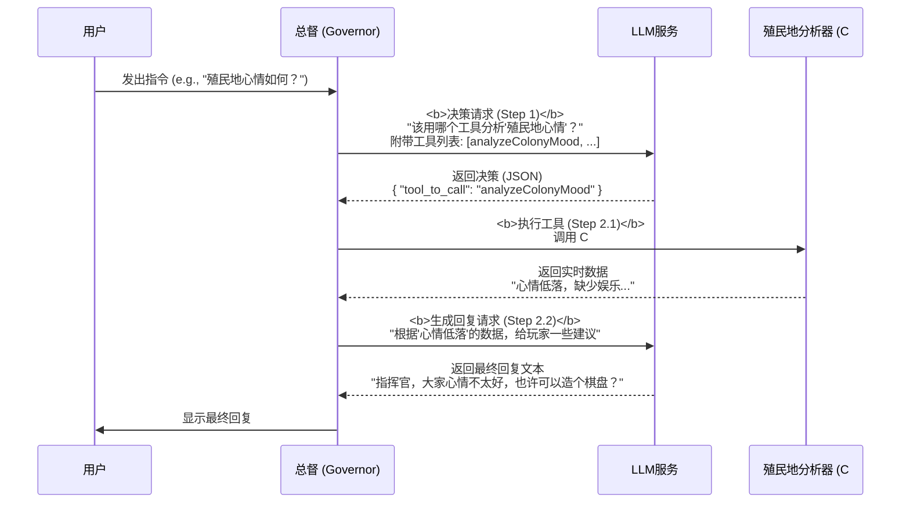
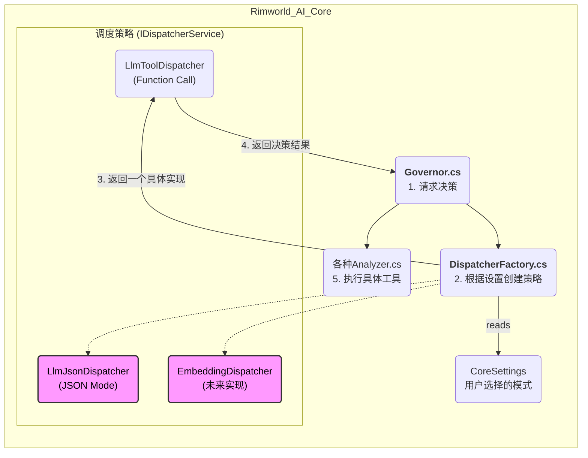
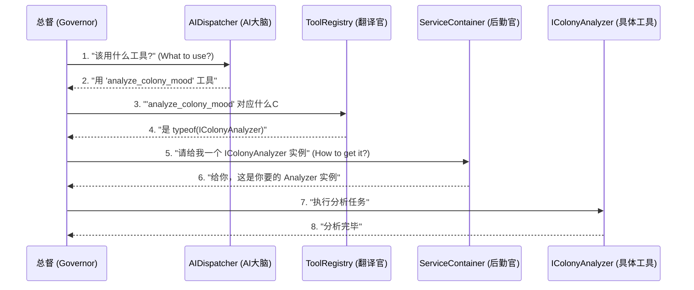

# TODO - 2025-07-23: 实现AI工具调用功能 (Function Calling)

## 🎯 最终目标 (Goal)

我们计划对 `Governor` 服务进行一次重大升级，从当前的“响应式”AI转变为“主动式”AI。具体来说，我们希望实现一个 **Function Calling** 或 **Tool Use** 的工作流：让AI不再是机械地使用单一模板进行回复，而是能**根据用户的输入，自主决策应该调用哪个内部功能（或使用哪个提示词模板）**。

这个新流程大致如下：
1.  **分派 (Dispatch)**: 向AI提供一个“工具清单”和用户输入，让AI以结构化的格式（如JSON）返回它选择的工具及所需参数。
2.  **执行 (Execute)**: C#代码解析AI的决策，然后调用对应的内部方法（如 `HandleUserQueryAsync` 或 `HandlePawnInfoQueryAsync`），并将最终结果返回给用户。

## 🌊 工作流图示 (Workflow Diagram)

## 🚀 架构设计：可插拔的调度器 (Architecture Design: Pluggable Dispatcher)

为了满足功能需同时兼容 `Function Calling` 和 `JSON` 模式，并为未来的 `Embedding` 本地化方案预留扩展空间，我们决定采用**策略模式 (Strategy Pattern)** 来构建核心的工具调度功能。

这将允许我们定义一系列可互换的算法（策略），并在运行时根据用户在设置中的选择，动态切换使用哪一种。

### 核心步骤

1.  **定义核心接口和模型 (`IDispatcherService`, `ToolModels.cs`)**:
    *   创建 `IDispatcherService` 接口，定义所有调度策略都必须遵守的契约（例如 `DispatchAsync` 方法）。
    *   创建 `ToolModels.cs` 等文件，用于定义 `AITool` 等与AI工具调用相关的标准化数据结构。

2.  **创建具体策略实现 (`*DispatcherService.cs`)**:
    *   `LlmToolDispatcherService`: 实现 `IDispatcherService` 接口，内部逻辑使用 `LLMService` 的 `WithTools()` 方法，通过 `Function Calling` API 完成工具选择。
    *   `LlmJsonDispatcherService`: 实现 `IDispatcherService` 接口，内部逻辑使用 `WithJsonOutput()`，通过一个精心设计的系统提示词来引导LLM返回指定格式的JSON，从而完成工具选择。
    *   `EmbeddingDispatcherService`: 预留的空实现，为未来通过本地向量匹配选择工具的功能占位。

3.  **创建调度器工厂 (`DispatcherFactory.cs`)**:
    *   创建一个静态工厂，它会读取 `CoreSettings` 中的用户配置，并返回一个具体的 `IDispatcherService` 实例。这是实现动态切换的关键。

4.  **更新设置 (`CoreSettings.cs` & `CoreSettingsWindow.cs`)**:
    *   在 `CoreSettings.cs` 中添加一个新的 `enum` (例如 `DispatchMode`)，包含 `LlmTool`, `LlmJson`, `LocalEmbedding` 等选项。
    *   在 `CoreSettingsWindow.cs` 中添加对应的UI控件，让用户可以方便地进行选择。

5.  **改造总督 (`Governor.cs`)**:
    *   重构 `Governor` 的核心决策逻辑。它将不再关心如何选择工具，而是完全委托给调度器。
    *   流程变为：通过 `DispatcherFactory` 获取当前策略 -> 调用策略的 `DispatchAsync` 方法获取决策 -> 执行决策。

### 架构图示

### 组件类比：DispatcherService 与 ServiceContainer (Analogy: DispatcherService vs. ServiceContainer)

为了更深刻地理解 `DispatcherService` 在我们架构中的角色，我们可以将它与项目中已经存在的 `ServiceContainer` 进行类比。一言以蔽之：**`DispatcherService` 就是 `ServiceContainer` 的“AI语义版本”**。

它们都负责“提供服务”，但其职责、驱动力和工作层面完全不同。

| 特性 | `ServiceContainer` (依赖注入容器) | `AIDispatcherService` (AI调度器) |
| :--- | :--- | :--- |
| **核心问题** | **"如何获取 (How to Get)?"** | **"应该用什么 (What to Use)?"** |
| **它的职责** | 我需要一个 `IHistoryService` 的实例，请**给我一个**。 | 用户想知道殖民地心情，请**告诉我用哪个工具**来分析。 |
| **驱动力** | **类型依赖 (Type Dependency)** | **语义意图 (Semantic Intent)** |
| **工作原理** | 基于代码中预先注册的类型映射。 (`Register<IHistoryService, HistoryService>()`) | 基于LLM对自然语言的理解，或Embedding的向量相似度计算。 |
| **决策方式** | **静态的、编译时的**。当代码需要一个`IHistoryService`时，它总是返回一个`HistoryService`实例。 | **动态的、运行时的**。根据用户每一句话的**含义**来做决策。 |
| **简单类比**| **后勤官/仓库管理员**：按清单（类型）索要工具，他从仓库（容器）里拿给你。 | **项目经理/指挥官**：告诉他目标（“我要加固墙”），他来决定你应该用锤子还是电钻。 |

#### 最终协作流程：避免重复造轮子 (Final Collaboration Workflow: Avoiding Reinventing the Wheel)

上述类比提出了一个高层设想，但要真正落地，必须解决一个核心问题：**如何优雅地将AI返回的工具名称（`string`）与C#世界中的服务实例（`object`）连接起来，同时完全复用 `ServiceContainer` 的依赖注入能力？**

答案是：**将 `ToolRegistryService` 升级为关键的“翻译官/映射器”**。

我们在注册工具时，就建立起“AI能理解的工具名”到“C#能理解的服务类型”之间的映射。这使得 `Governor` 的职责极其纯粹，只负责协调，而无需关心任何服务的创建细节。

最终的协作流程如下：

在这个流程中，我们完美地实现了：
-   **尊重依赖注入**：`ServiceContainer` 依然是创建和管理服务实例的唯一权威。
-   **避免重复造轮子**：`Governor` 中不存在任何 `if/else` 或 `switch` 来手动创建服务。
-   **高度可扩展**：添加新工具只需在 `ToolRegistry` 和 `ServiceContainer` 中各注册一行，无需改动核心协调逻辑。

这个设计将底层的**依赖解析（`ServiceContainer`）**和高层的**意图理解（`DispatcherService`）**清晰地分离开来，使得我们的AI系统既健壮又聪明。

## 📝 下一步行动计划 (Next Actions)

我们将按照上述架构设计，分步实现该功能。

1.  **【已完成】** 创建 `IDispatcherService` 接口和 `ToolModels.cs` 数据模型。
2.  **【已完成】** 创建 `ToolRegistryService` 并实现工具注册与类型映射。
3.  **【已完成】** 创建 `LlmToolDispatcherService` 和 `LlmJsonDispatcherService`。
4.  **【已完成】** 创建 `DispatcherFactory`。
5.  **【已完成】** 修改 `CoreSettings` 和 `CoreSettingsWindow` 以添加设置选项。
6.  **【已完成】** 重构 `Governor.cs` 以使用新的调度器架构。

**所有计划任务均已完成。** 