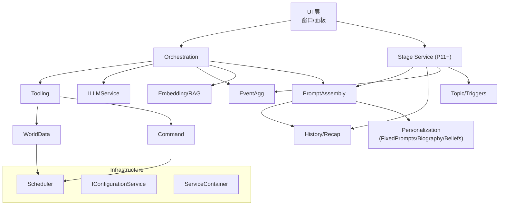

# RimAI.Core V4 架构文档

> 版本：v4.0.0-alpha  
> 状态：Living Document – 每完成一个阶段立即回填文档 & 图表

> 本文目标：
> 1. 继承 v3 的核心设计精髓（DI、网关、防腐层、五步工作流等）。  
> 2. 拆解为「小步快跑」的可持续增量，以最短路径交付可验证价值。  
> 3. 在每个里程碑锁定 **接口(contract) 不变更**，让下游可以安全并行开发。  

---

## 1. 战略目标（Why V4?）

| 目标 | 说明 | 衡量指标 |
|------|------|----------|
| 降低维护成本 | v3 的一次性完工模式导致 PR 巨大、回滚困难。V4 通过阶段交付，将回归点缩短至 ≤1 天代码量。 | *平均 PR 行数 ≤ 600* |
| 快速验证 & 反馈 | 每阶段产出**可运行**的 MVP，可由 QA/社区通过 Debug Panel 复现。 | *阶段演示录像* |
| 渐进式重构 | 允许旧逻辑在早期阶段以适配器/兼容层方式存在，避免「推倒重来」。 | *0 红色报错* |
| 文档即规范 | 所有接口签名一经文档发布即视为冻结；变更需走 `vNext`。 | *CI 检查文档与源码一致* |

---

## 2. 与 V3 的关系

| 分类 | V3 关键特性 | V4 处理策略 |
|------|-------------|-------------|
| **必保留** | ServiceContainer + 构造函数注入；CoreServices 受限使用；ILLMService 统一网关；Scheduler/WorldData 双层防腐；PromptFactory；五步编排；防火墙；自定义异常体系 | 保留接口与语义 *不变*，实现按阶段迁移；所有命名空间与类型保持向前兼容。 |
| **精简** | EventAggregator 默认 10 分钟冷却；History 双索引引擎；Persona 模板加载 | 仍保留，但延后至各自阶段；实现细节允许用更轻量方案起步（如内存 List → 字典）。 |
| **移除** | 旧版 `SafeAccessService`、未使用的 `EventBus` 订阅 API、过度包装的 DTO | 在 P0 即删掉并在编译期强制失败，确保无人继续引用。 |

> ⚠️ 决策理由请见 [`CHANGELOG.md`](../../CHANGELOG.md)。

---

## 3. 分阶段路线图

阶段表详见 `IMPLEMENTATION_V4.md`，此处只列核心门禁条件（Gate）：

| 阶段 | 关键 Gate（必须全部通过） |
|------|---------------------------|
| **P0 – Skeleton** | • RimAIMod 加载 ☐  • DebugPanel.Ping 按钮 ☐ |
| **P1 – DI & Config** | • ServiceContainer 注册自动化 ☐  • IConfigurationService.Reload 起效 ☐ |
| **P2 – LLM Gateway** | • ILLMService.GetCompletionAsync 回声测试 ☐  • DebugPanel 覆盖 流式 / 非流式 / JSON / Tools / 批量 请求测试 ☐ |
| **P3 – Scheduler + WorldData** | • 主线程调度器无卡顿 ☐  • GetPlayerName 返回正确值 ☐ |
| **P4 – Tool System** | • ToolRegistryService 支持自动发现 ☐  • GetColonyStatusTool 执行成功 ☐ |
| **P5 – Orchestration (Min)** | • ExecuteToolAssistedQueryAsync 完成五步闭环 ☐  • “殖民地概况”问答成功 ☐ |
| **P6 – Persistence** | • 退出 → 读档后 History 完整 ☐ |
| **P7 – Event Aggregator** | • 5 次伤病事件仅 1 次触发 LLM ☐ |
| **P8 – Persona & Stream UI** | • Assistant 对话流式返回 ☐  • Persona.SystemPrompt 生效 ☐ |
| **P9 – 策略层 + Embedding/RAG** | • 可切换 Classic/EmbeddingFirst 策略 ☐  • 工具向量库与匹配模式（LightningFast/FastTop1/NarrowTopK）与降级链 ☐  • RAG 命中与自动回退 Classic 有明确日志 ☐  • 轻量串联递归（≤3 步）生成 `final_prompt` 并注入 ☐ |
| **P10 – 历史/前情提要/提示组装** | • 历史仅记录“最终输出”且可分页/编辑 ☐  • 每 N 轮总结、每 10 轮叠加“前情提要” ☐  • `IPromptAssemblyService` 将固定提示/人物传记/前情提要/历史片段组装注入 ☐ |
| **P10.5 – 个性化模块（Personalization）** | • 新增 `IPersonalBeliefsAndIdeologyService` 与持久化 ☐ • 新“个性窗体”可编辑 固定提示词/人物传记/观点与意识形态 ☐ • 历史窗体移除个性编辑入口 ☐ • 组装服务从新个性化模块拉取素材 ☐ |
| **P11 – 舞台服务（Stage）** | • 会话串行化（convKey 锁）+ 合流窗口 + 冷却/幂等 ☐  • 非玩家路径统一非流式且仅写“最终输出” ☐  • 群聊轮次与选题/开场白（convKey override 注入）跑通 ☐ |
| **P11.5 – 薄舞台 + 仲裁内核** | • 引入 `IStageKernel`（资源互斥/lease/合流/冷却/幂等） ☐  • `GroupChatAct` 内化 Trigger/Topic/Persona，事件输出；`StageHistorySink` 仅落“最终输出” ☐  • Debug 面板可管理 Acts/Triggers/票据 ☐ |

每阶段的代码合并需附带录屏证明 Gate 全绿，以及更新本章节的 ✅ 标记。

---

## 4. 分层视图

> **变化亮点**：  
> • EventAggregator 延后到 P7，早期直接经由 Tooling 调 LLM。  
> • Persona 位于 UI → Orchestration 的调用参数中，而非独立层，降低早期耦合。  
> • 自 P10.5 起引入“个性化模块（Personalization）”：将“固定提示词/人物传记/观点与意识形态”从历史系统剥离为高内聚模块，`IPromptAssemblyService` 直接依赖之。

---

## 4.5 Core Contracts Layer（稳定对外层）

在代码结构上以 *RimAI.Core.Contracts* 独立程序集形式存在，只包含 **公共服务接口** 与 **数据 DTO**，无任何实现逻辑，遵循：
* **“对外可见最小面”** —— 仅暴露第三方 Mod 可能调用的 API；
* **接口签名冻结** —— 一旦发布不得破坏性修改，新增需走 SemVer 次版本；
* **零 RimWorld 依赖** —— DTO 不直接引用 `Verse` 类型，确保无游戏版本耦合。

| 分类 | 接口/DTO | 说明 |
|------|----------|------|
| 服务接口 | IOrchestrationService | `ExecuteToolAssistedQueryAsync` 提供五步编排入口，支持流式/非流式返回；只读 `GetAvailableTools()` 可选 |
|          | IToolRegistryService  | 获取工具清单 / 执行工具（外部可主动调用已注册工具） |
|          | IPersonaService      | **(v4.1+)** 支持对 Persona 的 CRUD 操作；可随存档持久化。 |
|          | IHistoryService (Query) | 只暴露 `GetHistoryAsync` 查询；写入仍由 Core 内部控制 |
|          | IConfigurationService (ReadOnly) | 暴露 `CoreConfig Current` 不可变快照 |
| DTO | ColonySummary / CommandResult | 典型 World & Command 层返回对象 |
|     | HistoricalContext / ConversationEntry | 对话历史结构体 |
|     | CoreConfigSnapshot | 对外暴露的只读配置快照 |
|     | Persona | SystemPrompt / Traits 等只读字段 |
|     | ToolFunction / ToolCall | 直接 re-export Framework.Contracts 定义 |
| 事件 | OrchestrationProgressEvent | 进度回调（阶段 + Payload） |
|      | AIExceptionEvent | 封装异常与调用上下文 |
|      | StageStarted / Coalesced / TurnCompleted / Finished | 舞台服务阶段事件（P11） |
|      | TopicSelectedEvent | 选题与场景文本生成事件（P11） |
|      | ActStarted / ActTurnCompleted / ActFinished / ActRejected / ActPreempted | 薄舞台事件模型（P11.5，沿用进度事件承载） |

> 外部开发者只需引用 `Framework.Contracts` + `Core.Contracts`，即可复用 AI 编排、扩展工具并监听事件。

---

## 5. 模块详细设计（按首次出现阶段排序）

### 5.1 Infrastructure（P0–P1）

1. **ServiceContainer** – 纯反射构造注入；禁止属性注入。  
2. **ConfigurationService** – 将 RimWorld `ModSettings` 序列化为不可变对象 `CoreConfig`；Hot-Reload 通过事件广播。  
3. ~~CacheService~~ – 自 v4.1 起，缓存子系统已下沉至 RimAI.Framework，由 Framework 统一处理 Chat/Embedding 等请求的缓存与合流；Core 不再提供通用缓存实现。

### 5.2 LLM 模块（P2）

| 接口 | 说明 |
|------|------|
| `ILLMService` | 网关 + 防火墙；公开 `GetResponseAsync` 和（P8）`StreamResponseAsync` |
| `LLMService` | 内部装饰 `RetryPolicy`；仅此文件 `using RimAIApi;`（缓存由 Framework 处理） |

> 🚧 **简化**：重试策略先硬编码 3 次退避；熔断器延后到 P5 完成。

### 5.3 WorldAccess（P3）

* **ISchedulerService** – `ScheduleOnMainThread(Action)`，并在 `GameComponent.Update` 中泵出。  
* **IWorldDataService** – 只实现 `GetPlayerNameAsync`，后续 API 随阶段增量。  

### 5.4 Tooling（P4）

* **IToolRegistryService** – 启动时 Assembly 扫描；工具类由 DI 注入依赖。  
* **IRimAITool** – 必须提供 JSON Schema；参数校验由 `System.Text.Json` 完成。  

### 5.5 Orchestration（P5）

* **IOrchestrationService** – 五步工作流；仅公开 `ExecuteToolAssistedQueryAsync`。  
* 早期仅支持单轮问答；多轮与 History 交互在 P6 打开。  

### 5.6 Persistence（P6）

遵循 v3 的「发令员-总工程师-专家」模型；但初版仅持久化 HistoryService 状态。其余服务在后续版本按需扩展。

### 5.7 Eventing（P7）

* **IEventBus** – 轻量 `Publish/Subscribe`。  
* **IEventAggregatorService** – 定时器 & 冷却窗；仅聚合伤病事件 MVP。  

### 5.8 Persona & Streaming（P8） ✅

* **设计演进**: P8 阶段对 Persona 系统的设计进行了重大升级。它已从最初的“从 Defs 读取静态模板”演变为一个**支持玩家动态管理并可随存档持久化的成熟系统**。
* **IPersonaService**: 接口将支持完整的 CRUD（创建、读取、更新、删除）操作。其实现将负责管理所有 `Persona` 实例，并与 `IPersistenceService` 对接，以实现数据的存盘与读档。
* **UI**: 将会有一个独立的管理窗口供玩家进行 Persona 的 CRUD 操作。主聊天界面将动态加载这些人格供玩家选择。
* `ILLMService.StreamResponseAsync` 支持 `IAsyncEnumerable`；UI 逐块渲染。
* ⚠️ 使用规范：仅允许在 Chat 窗体与 Debug 窗体中启用“流式”模式；所有服务型/后台型调用（历史总结、事件聚合、Embedding/RAG 构建、索引等）一律使用“非流式”同步返回形式，避免资源占用与 UI 干扰。

#### 5.8.1 Persona 服务与“对话组织者”的职责划分

- Persona 会话服务（`IPersonaConversationService`）
  - **职责**：
    - 仅负责基于 `IPromptAssemblyService` 组装 system 提示；
    - 按调用方指定的模式（流式/非流式）调用 `ILLMService` 并返回结果；
    - 不负责历史落盘，不内置会话状态管理。
  - **模式**：
    - Chat 支持流式与非流式；
    - Command 支持流式与非流式（非流式聚合所有分片后一次性返回）。

- 对话组织者（Conversation Orchestrator）
  - **定义**：上游业务方，负责决定调用模式、生命周期与历史写入。`Chat UI` 即为一种对话组织者；其他后台/服务也属于对话组织者。
  - **职责**：
    - 统一负责历史写入（仅记录“最终输出”）。
    - Chat UI 固定使用流式，并在流结束后一次性写入历史；
    - 其他后台/服务固定使用非流式，在拿到完整文本后一次性写入历史。
  - **好处**：职责单一、历史一致（最终输出）、避免分片写入抖动，方便统一审计与重试。

---

### 5.9 Orchestration 策略层 + Embedding/RAG（P9）

- 策略层：通过内部接口 `IOrchestrationStrategy` 抽象编排实现；`OrchestrationService` 按 `CoreConfig.Orchestration.Strategy` 选择并委派（回退 Classic）。
- 策略实现：
  - `ClassicStrategy`：保留五步流程（工具决策→执行→复述）。
  - `EmbeddingFirstStrategy`：在 Step 0 前置 RAG（`IEmbeddingService` + `IRagIndexService` 相似度检索），把检索上下文注入到对话再进入工具与总结。
- 工具匹配模式：`LightningFast`（Top1 直出字符串，参数注入 `__fastResponse=true`）/`FastTop1`/`NarrowTopK`/`Classic`/`Auto`（按链路自动降级）。
- 工具向量索引：`IToolVectorIndexService` 负责构建/加载 `tools_index_{provider}_{model}.json`（含指纹）；可在启动或设置保存后触发全量重建，支持“构建期间阻断工具相关功能”。
- 轻量“串联递归”规划：`Planning/Planner` + `PlanModels`（黑板、去重 `sha256(tool+args)`、护栏 MaxSteps/Latency/Budget/Satisfaction）；构建 `final_prompt` 注入到最终请求；仅只读工具可小并发（默认关闭）。
- 进度可观测：阶段进度通过 `OrchestrationProgressEvent` 广播，Debug 面板可实时打印阶段信息与可选 Payload。
- 配置：新增 `CoreConfig.Orchestration`（Strategy/Clarification/Planning/Progress/Safety）与 `CoreConfig.Embedding`（TopK/MaxContextChars/Tools.Mode/阈值/IndexPath/动态阈值等）；保存热生效并可触发索引重建。

> 现状（已对齐实现）：
> - DI 已注册 `IEmbeddingService`、`IRagIndexService`、`IToolVectorIndexService` 与两类策略；`OrchestrationService` 以 `IEnumerable<IOrchestrationStrategy>` 注入并选择策略。
> - Debug 面板订阅 `OrchestrationProgressEvent`，展示阶段日志与可选 Payload 预览。

---

### 5.10 历史记录 / 前情提要 / 提示组装（P10）

- 数据与持久化：历史仅保存“最终输出”（用户/AI/工具），每 N 轮生成“总结”、每 10 轮滚动叠加成“前情提要字典”；固定提示词与人物传记（段落型字典）文本入档；Embedding/RAG 严禁入档，仅运行期构建。
- ID 与参与者：统一使用 `IParticipantIdService` 生成/解析 ID（如 `pawn:<loadId>`/`player:<saveInstanceId>`/`persona:<name>#<rev>`），支持 convKey = join('|', sort(participantIds)) 聚合与检索。
- 历史服务扩展：`IHistoryService` 支持仅最终输出的写入、子集检索、编辑与分页；事件 `OnEntryRecorded` 供 `IRecapService` 监听。
- 总结与前情提要：`IRecapService` 后台异步按轮次生成总结与叠加；提供 `RebuildRecapAsync`。
- 提示组装：`IPromptAssemblyService` 统一拼装 system 提示：固定提示词 → 人物传记段落（1v1 时）→ 前情提要 K 条 → 相关历史片段 → 其它上下文；受 `CoreConfig.History.MaxPromptChars` 控制并记录裁剪信息。
- UI：提供历史管理窗体（P10.5 前为 5 个 Tab，P10.5 起精简为 3 个 Tab：历史/前情提要/关联对话），以及 Debug 面板对提示组装摘要与裁剪的预览。
### 5.11 个性化模块 / 个性窗体（P10.5）

- 动机：将“我是谁（静态个性）”从“我经历了什么（动态历史）”中解耦，提升内聚与清晰度，为 P11 舞台/戏剧化交互打基础。
- 服务与依赖：
  - 新增 `IPersonalBeliefsAndIdeologyService`（键=PawnId，线程安全内存实现，支持导入/导出快照）。
  - `IPromptAssemblyService` 依赖扩展：`IFixedPromptService`、`IBiographyService`、`IPersonalBeliefsAndIdeologyService`、`IRecapService`、`IHistoryQueryService`。
  - 组装顺序建议：Beliefs（观点/意识形态，最稳定）→ Biography（1v1）→ FixedPrompts（场景口癖/规则，按 Pawn）→ Recap/History（动态上下文）。
  - 兼容性：若模板未新增“beliefs”专用标签，Beliefs 合并注入到 `persona` 段，确保无模板变更也能生效。
- UI：
  - 新增主标签页窗口 `MainTabWindow_Personality`（左：可搜索小人列表；右：三个 Tab）。
    - Tab1 固定提示词：按 PawnId 编辑，不再提供 convKey 级覆盖入口。
    - Tab2 人物传记：段落型字典的增删改/排序，仅在 1v1（player↔pawn）时由组装服务注入。
    - Tab3 观点与意识形态：四段文本（世界观/价值观/行为准则/人格特质），内置若干“预设模板”。
  - 历史管理窗体（History Manager）自 P10.5 起移除“固定提示词/人物传记”两个 Tab，仅保留“历史记录/前情提要/关联对话”。
- 持久化：
  - 新增存档节点 `RimAI_PersonalBeliefsV1`（pawnId → PersonalBeliefs）。
  - `PersistenceManager` 在 Saving/Loading 调用 `PersistPersonalBeliefs`/`LoadPersonalBeliefs`。
- DI：在 `ServiceContainer.Init` 注册 `IPersonalBeliefsAndIdeologyService -> PersonalBeliefsAndIdeologyService`；`PromptAssemblyService` 构造注入已对齐。
- Gate（验收）：
  - 个性窗体可编辑并保存三类数据；读档后保持不变；Debug 面板 Prompt 审计可见个性文本；历史窗体不再含个性编辑。

---

### 5.12 舞台服务（P11）

- 定位：位于 UI/后台业务 与 Persona 会话服务之间，统一处理会话键、合流/幂等/冷却、轮次调度与历史写入；确保仅记录“最终输出”。Chat UI 为舞台的一种实现（仅在 UI 内部流式），其余后台路径固定非流式。
- 核心概念：
  - convKey = `join('|', sort(participantIds))`（顺序无关，唯一标识会话）；会话锁串行化同一 convKey。
  - 合流窗口（默认 300ms）合并同 convKey 的多源触发；幂等键（`hash(sourceId+convKey+scenario+seed)`）短期复用；冷却时间避免骚扰触发。
  - Eligibility：`MinParticipants=2`，`MaxParticipants`（默认 5，最大 10）；参与者适配性过滤（非敌对、非战斗/睡眠、在线等）；`Origin` 必须为允许集合。
- 舞台表演项（Stage Acts）：可插拔剧目（如 `GroupChat/Interrogation/Trial/...`），可声明参与者角色与终止条件；默认 Act 为群聊，支持稳定随机顺序与轮次推进。
- 选题与开场白：通过 `IFixedPromptService.UpsertConvKeyOverride(convKey, scenarioText)` 注入“场景提示”（会话级，整场复用）；结束后清理覆盖。
- 事件与可观测：广播 `StageStarted/Coalesced/TurnCompleted/Finished` 与 `TopicSelectedEvent`；透传 Prompt 组装审计摘要。
- 历史策略：仅写“最终输出”（用户/AI/工具）；群聊可在元数据中记录 `audience`、`coalesced`、`seed` 等。
- 配置（新增 `CoreConfig.Stage` 根）：
  - 核心：`CoalesceWindowMs/CooldownSeconds/MinParticipants/MaxParticipants/PermittedOrigins/EligibilityRules/MaxLatencyMsPerTurn/RetryPolicy/LocaleOverride`。
  - 扫描：`Stage.Scan` 与 `Stage.ProximityScan`（邻近度扫描、概率/阈值触发、每轮上限）。
  - 选题：`Stage.Topic.Enabled/Sources(weights)/MaxChars/DedupWindow/SeedPolicy/Locale`。
- 接口概要（内部约定）：`IStageService.StartAsync(StageRequest)`（后台固定 `stream=false`）；`IStageAct` 执行剧目；`ITopicProvider/ITopicService` 选题与开场白生成；不向 Core.Contracts 暴露写入接口，仅事件向外可见。
- Gate：
  - 非玩家发起仅能通过舞台入口；参与者 < 2 拒绝；同 convKey 并发只执行一次；合流/冷却生效。
  - Persona 非流式接入并写入“最终输出”；双源并发场景录屏验证单次输出与历史一致。
  - 群聊 N 轮跑通；选题与开场白注入；结束清理覆盖。

---

### 5.13 薄舞台 + 仲裁内核（P11.5）

- 目标：压薄舞台，仅保留注册/启停/仲裁/Debug 路由/运行中查询；业务（扫描/选题/逐轮流程/逐轮历史）下沉至 `Act` 与其配套 `Trigger`。
- 仲裁内核（`IStageKernel`）：
  - 资源声明与预定：`ActResourceClaim{convKeys[], participantIds[], mapId?, exclusive}`；同一 convKey 强互斥；参与者集合相交互斥；可选地图级互斥。
  - 能力：`TryReserve/ExtendLease/Release`（lease TTL 防泄漏）、`CoalesceWithin`、`Cooldown`、幂等缓存。
- 数据与事件模型：
  - 模型：`StageIntent/StageDecision/StageTicket/StageExecutionRequest/RunningActInfo`。
  - 事件：`ActStarted/ActTurnCompleted/ActFinished/ActRejected/ActPreempted`（可沿用 `OrchestrationProgressEvent` 承载，Source=Act/Kernel，PayloadJson 结构化）。
- 历史与素材：
  - `StageHistorySink` 订阅 Act 事件，仅写“最终输出”。
  - `IStageRecapService`（内部）保存 Act 总结素材（`ActRecapEntry`），提供查询/导入导出；`IStageService` 可对外提供只读查询入口（后续版本）。
- 配置与 UI：
  - `CoreConfig.Stage` 新增 `DisabledActs/DisabledTriggers`；保留 `ProximityScan/Topic` 供 `GroupChatAct/Trigger` 使用；新增 Act 专属配置（如 `GroupChatConfig`）。
  - 设置页新增 “Stage/Acts” 分节：列出已注册 Acts/Triggers 并支持启停，进入各 Act 配置页。
- 实施要点：
  - 新增 `Modules/Stage/Kernel/StageKernel.cs`；精简 `StageService`；改造 `GroupChatAct` 内化 Trigger/Topic/Persona 并产出事件；可选接线 `StageHistorySink`。
- Gate：
  - Kernel：同一 convKey/参与者相交互斥；lease 超时自动回收；幂等缓存可用。
  - Act：群聊 N 轮跑通，仅事件输出；StageHistorySink 仅“最终输出”落盘且回放一致。
  - 仲裁：同一 convKey 的两个 Act 请求只执行一个；禁用/启用 Act/Trigger 生效；Debug 面板可列出票据并强制释放。

---

## 6. 质量保证策略

1. **CI** – 自动编译 + UnitTest + `dotnet format`；Docs 与源码签名一致性检查。  
2. **阶段性 QA** – 每阶段 Gate 由 QA 录像验证。
3. **异常落盘** – 所有自定义异常在顶层捕获后写入 `Log/ RimAI.err`，方便社区回报。  
4. **性能预算** – 每帧新增耗时 ≤ 1 ms（Profiler）。  
5. **运行时兼容性** – 所有代码必须保持 .NET Framework 4.7.2 兼容，严禁使用更高版本 API 或语法特性。

---

## 7. 风险与缓解

| 风险 | 阶段 | 应对策略 |
|------|------|----------|
| Harmony Patch 冲突 | P0–P8 | 所有 Patch 前缀 `RimAI_`，并集中注册；每日跑「冲突扫描脚本」。 |
| ChatGPT API 费用激增 | P2+ | 由 Framework 缓存与合流统一控制；Debug 面板显示月度 Token 使用量（待 Framework 暴露指标）。 |
| 线程安全死锁 | P3+ | Scheduler 内部使用 `ConcurrentQueue` + 主线程泵出，无锁等待。 |
| 存档兼容性破坏 | P6+ | IPersistenceService 在字段增删时保持 `Scribe_Deep` 列表顺序；旧字段标记 `[Obsolete("v3-remain")]`。 |
| 模板耦合风险 | P10.5 | Beliefs 缺省合并注入到 `persona` 段，避免模板缺失造成“无输出”；后续可逐步引入专用标签。 |

---

## 8. 版本号 & 提交流程

1. **分支策略** – 每阶段使用 `feature/Px_*`；合并到 `core/v4-main` 触发 CI 发布 `core/v4.x.x-alpha|beta`。  
2. **重放测试** – 合并前必须在 Debug 面板跑脚本 `AllStageSmokeTest.cs`.  
3. **Tag 命名** – `core/v4.{阶段序号}.{Patch}`，如 `core/v4.3.1` = 完成 P3 后的第 1 个热补丁。

---

> 本文自 v4.0.0-alpha 起生效。任何修改请在 PR 描述写明「更新 ARCHITECTURE_V4.md 第 X 节」。

