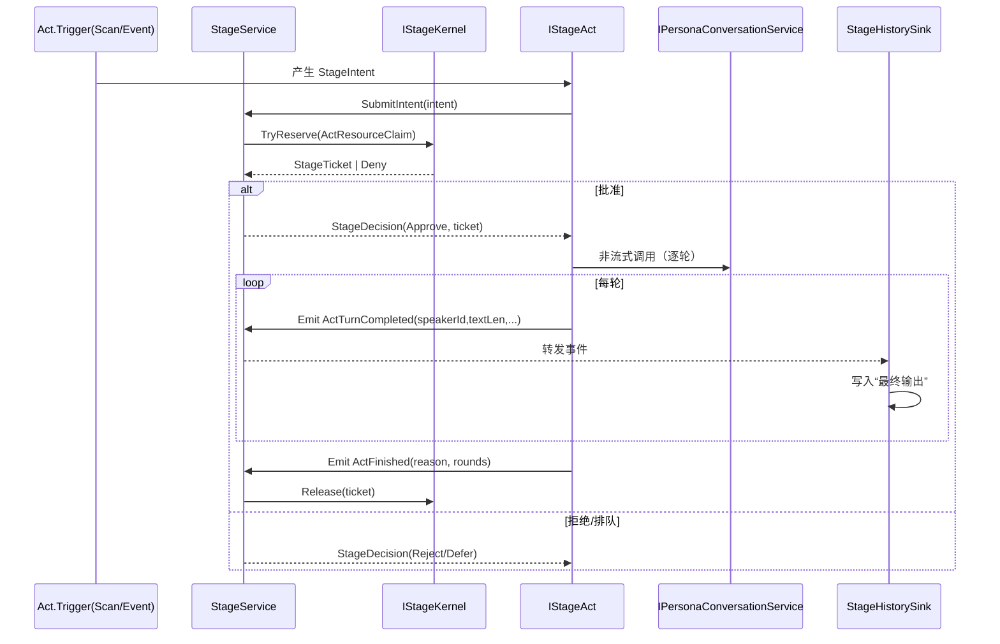

## P11.5 实施计划：舞台薄层 + Act 自包含 + 仲裁内核（Orchestration Kernel）

### 1. 背景与目标
- 现状（P11）中，舞台服务承担了触发、编排、选题、历史写入、扫描、合流/冷却/幂等等多种职责，层次偏厚。
- 目标：将舞台压薄，业务下沉到 Act 与独立 Trigger 组件；舞台只做“开/关、注册、仲裁（避免撞车）”与全局设置。每个 Act 必须有配套 Trigger（主动扫描 / 被动事件）。Act 仅负责执行对话流程与在结束时返回“最终输出（FinalText）”；若该 Act 需要逐轮写历史，由 Act 自主完成，与最终输出无关联。

收益：
- 职责清晰、强内聚：新增/修改 Act 不改舞台核心。
- 可控并发：舞台通过仲裁内核统一避免“会话/参与者撞车”。
- 更好可观测：每个 Act 自发事件，外部 Sink/Debug 统一消费。

---

### 2. 总体架构（薄舞台 + Trigger + Act + 仲裁内核）
 - StageService（极薄）：维护 Act 与 Trigger 的注册/启停；仲裁与 ticket 发放/回收；Debug 执行与运行中查询。
 - IStageTrigger（触发器）：主动扫描/被动事件；产出 StageIntent，经 Stage 仲裁后触发执行。
 - IStageAct（剧目）：只负责执行与在结束时返回 FinalText；逐轮历史如需则由 Act 内部写入。
- IStageKernel（仲裁内核）：
  - 资源声明/预定（convKey/participants/mapId 等），避免撞车。
  - 合流窗口、冷却窗口、幂等缓存等横切能力。
  - 票据 lease/续租/回收，防止长持锁导致死锁。
> 注：当前版本由 Stage 写入最终输出；后续可引入统一 Sink。

---

### 3. 核心接口与模型（对齐实现）

1) 舞台薄层（Stage）
 - IStageService：Act（Register/Unregister/Enable/Disable/List）、Trigger（Register/Unregister/Enable/Disable/List）、SubmitIntent、StartAsync（Debug）、QueryRunning。

- 数据模型
  - StageIntent { actName, participants[], convKey, origin, scenario?, priority?, seed?, locale? }
  - StageDecision { outcome: Approve|Reject|Defer, reason?, ticket? }
  - StageTicket { id, convKey, participants[], expiresAtUtc }
  - StageExecutionRequest { actName, participants[], convKey?, userInput/scenario?, locale?, seed?, targetParticipantId? }
  - RunningActInfo { actName, convKey, participants[], sinceUtc, leaseExpiresUtc }

2) 仲裁内核（Kernel）
- IStageKernel
  - TryReserve(ActResourceClaim claim, out StageTicket ticket)
  - ExtendLease(StageTicket ticket, TimeSpan ttl)
  - Release(StageTicket ticket)
  - IsBusyByConvKey(string convKey) / IsBusyByParticipant(string pid)
  - CoalesceWithin(string convKey, int windowMs, Func<Task<bool>> leaderWork)
  - IsInCooldown(string convKey) / SetCooldown(string convKey, TimeSpan cooldown)
  - Idempotency.TryGet(string key, out ResultSnapshot) / Set(string key, ResultSnapshot, ttl)

- 资源声明
  - ActResourceClaim { convKeys[], participantIds[], mapId?, exclusive: bool }
  - 缺省规则：同一 convKey 强互斥；参与者集合交集≠∅ 时互斥；地图级互斥由 Act 决定。

3) Act（执行单元）
 - IStageAct：`Name`/`IsEligible(ActContext)`/`RunAsync(ActContext, ct)`；`ActResult{ Completed, Reason, Rounds, FinalText }`；`ActContext{ convKey, participants, seed, locale, options, persona, history, participantId, events }`。

4) 触发器（Trigger）
 - IStageTrigger：`Name`/`TargetActName`/`Subscribe`/`OnEnable`/`OnDisable`/`RunOnceAsync`。

4) 事件（对外统一）
- ActStarted { actName, convKey, participants[], ticketId, startedAt }
- ActTurnCompleted { actName, convKey, speakerId, textLen, roundIndex, payload? }
- ActFinished { actName, convKey, ticketId, reason, rounds, payload?, recap? }
- ActRejected { actName, convKey, reason }
- ActPreempted { actName, convKey, byActName, reason }
说明：可沿用 OrchestrationProgressEvent 承载（Source=ActName/StageKernel，Stage=Started/TurnCompleted/Finished/Rejected/Preempted），PayloadJson 结构化数据。

6) 历史落盘（后续可选）
- StageHistorySink：订阅 ActTurnCompleted/ActFinished，仅写“最终输出”。
  - 外部依赖：IHistoryWriteService / IHistoryQueryService

7) Act 总结/素材库（建议）
- 要求：每个 Act 执行完毕后，必须返回一个“总结（Recap）”，由 Act 负责“组装提示词 + 调用 LLM 生成”。该 Recap 将作为“素材”入库，供后续策略/提示组装/调参使用。
- 产物模型（Act 内部返回）：
  - ActRecapPayload {
    - title: string 生成的标题（必填，尽量简练唯一）
    - triggerAtUtc: DateTime 触发时间点（必填，UTC）
    - summaryText: string 总结正文（必填）
    - participants[]: string 涉及对象（可选）
    - metadata: object 任意结构（可选，Act 制作者自定义，推荐 JSON-serializable）
    - tags[]: string 可选标签
    }
  - 事件携带：ActFinished.recap = ActRecapPayload
- 入库与访问：
  - 由“舞台素材库服务（IStageRecapService）”负责保存/查询/持久化；
  - 字典键：{ title, triggerAtUtc } 组成复合键（同名不同时间点可并存）；
  - 对外访问通过 IStageService 暴露只读查询接口。
- 持久化：
  - StageRecapState { items: List<ActRecapEntry> }；
  - ActRecapEntry = { title, triggerAtUtc, actName, convKey, participants[], summaryText, metadataJson?, tags[], createdAtUtc }。
  - 读写由 PersistenceManager 统一本地化，节点名建议：RimAI_StageRecapV1。

8) 新增/扩展接口（摘要）
- IStageRecapService（内部）
  - void Upsert(ActRecapEntry entry)（以 {title, triggerAtUtc} 作为唯一键）
  - IReadOnlyList<ActRecapEntry> GetAll()
  - IReadOnlyList<ActRecapEntry> QueryByTitle(string title)
  - IReadOnlyList<ActRecapEntry> QueryRange(DateTime fromUtc, DateTime toUtc)
  - StageRecapState ExportSnapshot(); void ImportSnapshot(StageRecapState state)
- IStageService（对外新增只读）
  - IReadOnlyList<ActRecapEntry> GetActRecaps()

---

### 4. 配置方案
 - CoreConfig.Stage：保留全局项；新增 `DisabledActs`/`DisabledTriggers`；保留 `ProximityScan` 与 `Topic` 供 GroupChatTrigger/Act 使用。

- Act 专属配置（示例：GroupChatConfig）
  - ProximityScan: Enabled, RangeK, TriggerMode=Threshold|Probability, TriggerThreshold|ProbabilityP, OnlyNonHostile, ExcludeBusy
  - Rounds: GroupChatMaxRounds
  - Topic: Enabled, Sources(weights), MaxChars, DedupWindow, SeedPolicy

- 设置面板 UI 调整
  - 新增 “Stage/Acts” 分节：
    - 列出所有注册 Act + 启用/禁用开关
    - 点击进入该 Act 的配置页（GroupChatConfig 等）

---

### 5. 运行流程（时序）


---

### 6. 与现有实现的改造清单（对齐代码）

1) 精简 StageService（`Modules/Stage/StageService.cs`）
 - 删除扫描管线；选题由 Act 处理；最终输出由 Stage 写入。
 - 保留 Act/Trigger 注册、仲裁、Debug 路由、运行中查询；注入 IStageKernel。

2) 引入 IStageKernel（新）
- 新文件：`Modules/Stage/Kernel/StageKernel.cs`，实现 TryReserve/Release/ExtendLease/Coalesce/Cooldown/Idempotency 等。
- 使用 ConcurrentDictionary + SemaphoreSlim（convKey 粒度）管理资源；lease TTL 防止长持锁。

3) （可选）StageHistorySink：后续版本用于统一落盘“最终输出”。

4) Act 改造（以 GroupChatAct 为例）
 - 选题/场景注入下沉到 Act；逐轮历史写入保留在 Act；结束时返回 FinalText。
- 在执行前向 Stage 提交 Intent，获得 ticket 后执行；执行期间周期性 ExtendLease。

5) 配置：`CoreConfig.Stage` 新增 `DisabledActs/DisabledTriggers`；保留 `ProximityScan` 与 `Topic`。

6) DI 注册
- 注册 IStageKernel、StageHistorySink（构造时订阅事件）。
- 通过 StageService.RegisterAct 注册 GroupChatAct；支持列表化注入。

7) Debug 面板
- 新增：
  - “列出已注册 Acts 与启停状态”、“启用/禁用 Act”
  - “执行一次 Act 触发器（RunActiveTriggersOnceAsync）”
  - “直接执行 Act（ExecuteAsync）”
  - “查看运行中票据/占用资源/强制释放票据”

---

### 7. 里程碑与 Gate
- M1：StageKernel + 注册表
  - Gate：
    - 同一 convKey 互斥；参与者交集互斥；lease 超时自动回收；Idempotency 可用。
- M2：GroupChatAct 内化（触发器/Topic/Persona 调用）
  - Gate：
    - 群聊 N 轮跑通；仅事件输出，不直接写历史。
- M3：StageHistorySink
  - Gate：
    - 仅“最终输出”落盘；回放一致；删除历史中间态。
- M4：舞台仲裁（避免撞车）
  - Gate：
    - 同一 convKey 的两个 Act 请求只执行一个；另一被拒绝/排队。
- M5：事件触发器（被动） + 主动触发器（扫描）
  - Gate：
    - 在 Demo 地图稳定触发 2 人群聊；禁用后不触发。
- M6：Debug/观测
  - Gate：
    - Debug 面板可查看/操作 Acts、票据、强制结束；事件输出清晰。

---

### 8. 风险与缓解
- 触发风暴：合流窗口 + 冷却 + Idempotency；必要时全局并发上限与节流。
- 死锁/票据泄漏：lease TTL + 续租，超时自动回收；执行结束务必 Release。
- 事件丢失：事件总线订阅在初始化即完成；异常打印与降级。
- 配置迁移：Stage → ActConfig 的配置迁移脚本与兼容读取。

---

### 9. 附录：契约草案（C# 伪代码）
```csharp
interface IStageService {
  void RegisterAct(IStageAct act); void UnregisterAct(string name);
  void EnableAct(string name); void DisableAct(string name);
  IReadOnlyList<string> ListActs();
  StageDecision SubmitIntent(StageIntent intent);
  Task<IAsyncEnumerable<Result<UnifiedChatChunk>>> StartAsync(StageExecutionRequest req, CancellationToken ct);
  IReadOnlyList<RunningActInfo> QueryRunning();
}

interface IStageKernel {
  bool TryReserve(ActResourceClaim claim, out StageTicket ticket);
  void ExtendLease(StageTicket ticket, TimeSpan ttl);
  void Release(StageTicket ticket);
  bool IsBusyByConvKey(string convKey); bool IsBusyByParticipant(string pid);
  Task<bool> CoalesceWithin(string convKey, int windowMs, Func<Task<bool>> leaderWork);
  bool IsInCooldown(string convKey); void SetCooldown(string convKey, TimeSpan cd);
  bool IdempotencyTryGet(string key, out ResultSnapshot snap); void IdempotencySet(string key, ResultSnapshot snap, TimeSpan ttl);
}

interface IStageAct {
  string Name { get; }
  Task OnEnableAsync(IStageKernel kernel, CancellationToken ct);
  Task OnDisableAsync(CancellationToken ct);
  void Subscribe(IEventBus bus, IStageKernel kernel); // optional passive trigger
  Task RunActiveTriggersOnceAsync(IStageKernel kernel, CancellationToken ct); // optional scan trigger
  Task ExecuteAsync(StageExecution ctx, CancellationToken ct); // explicit debug/script
}
```

---

### 10. 实施建议（顺序）
1) 增加 IStageKernel + 实现；引入 StageHistorySink 并接线事件总线。
2) 改造 GroupChatAct：内化触发器/选题/Persona 调用 → 发事件；删除直接写历史。
3) 精简 StageService：仅保留注册/启停/仲裁/Query；StartAsync 改为路由到 Act。
4) 配置迁移与 UI：新增 ActConfig；迁移 Stage.ProximityScan/Topic 等至 GroupChatConfig。
5) Debug 面板扩展：Acts 列表、票据/资源、强制结束、触发器执行。


