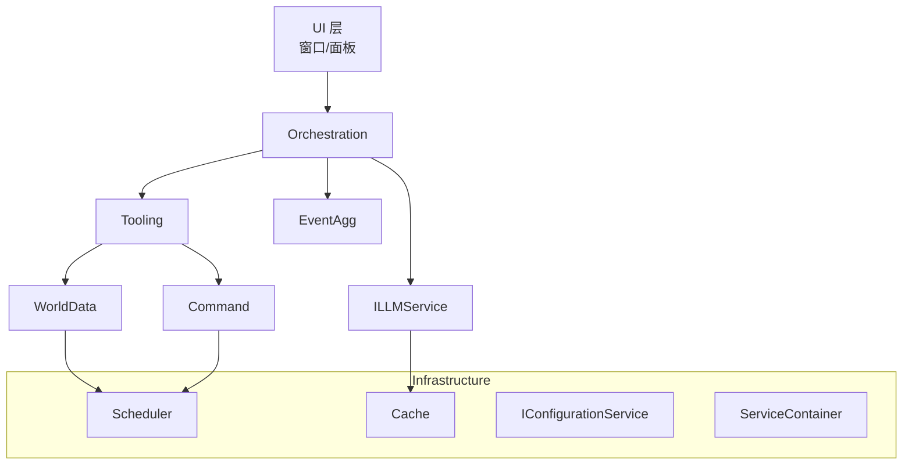

# RimAI.Core V4 架构文档

> 版本：v4.0.0-alpha  
> 状态：Living Document – 每完成一个阶段立即回填文档 & 图表

> 本文目标：
> 1. 继承 v3 的核心设计精髓（DI、网关、防腐层、五步工作流等）。  
> 2. 拆解为「小步快跑」的可持续增量，以最短路径交付可验证价值。  
> 3. 在每个里程碑锁定 **接口(contract) 不变更**，让下游可以安全并行开发。  

---

## 1. 战略目标（Why V4?）

| 目标 | 说明 | 衡量指标 |
|------|------|----------|
| 降低维护成本 | v3 的一次性完工模式导致 PR 巨大、回滚困难。V4 通过阶段交付，将回归点缩短至 ≤1 天代码量。 | *平均 PR 行数 ≤ 600* |
| 快速验证 & 反馈 | 每阶段产出**可运行**的 MVP，可由 QA/社区通过 Debug Panel 复现。 | *阶段演示录像* |
| 渐进式重构 | 允许旧逻辑在早期阶段以适配器/兼容层方式存在，避免「推倒重来」。 | *0 红色报错* |
| 文档即规范 | 所有接口签名一经文档发布即视为冻结；变更需走 `vNext`。 | *CI 检查文档与源码一致* |

---

## 2. 与 V3 的关系

| 分类 | V3 关键特性 | V4 处理策略 |
|------|-------------|-------------|
| **必保留** | ServiceContainer + 构造函数注入；CoreServices 受限使用；ILLMService 统一网关；Scheduler/WorldData 双层防腐；PromptFactory；五步编排；缓存、防火墙；自定义异常体系 | 保留接口与语义 *不变*，实现按阶段迁移；所有命名空间与类型保持向前兼容。 |
| **精简** | EventAggregator 默认 10 分钟冷却；History 双索引引擎；Persona 模板加载 | 仍保留，但延后至各自阶段；实现细节允许用更轻量方案起步（如内存 List → 字典）。 |
| **移除** | 旧版 `SafeAccessService`、未使用的 `EventBus` 订阅 API、过度包装的 DTO | 在 P0 即删掉并在编译期强制失败，确保无人继续引用。 |

> ⚠️ 决策理由请见 [`CHANGELOG.md`](../../CHANGELOG.md)。

---

## 3. 分阶段路线图

阶段表详见 `IMPLEMENTATION_V4.md`，此处只列核心门禁条件（Gate）：

| 阶段 | 关键 Gate（必须全部通过） |
|------|---------------------------|
| **P0 – Skeleton** | • RimAIMod 加载 ☐  • DebugPanel.Ping 按钮 ☐ |
| **P1 – DI & Config** | • ServiceContainer 注册自动化 ☐  • IConfigurationService.Reload 起效 ☐ |
| **P2 – LLM Gateway** | • ILLMService.GetCompletionAsync 回声测试 ☐  • 缓存命中率计数可在面板查看 ☐  • DebugPanel 覆盖 流式 / 非流式 / JSON / Tools / 批量 请求测试 ☐ |
| **P3 – Scheduler + WorldData** | • 主线程调度器无卡顿 ☐  • GetPlayerName 返回正确值 ☐ |
| **P4 – Tool System** | • ToolRegistryService 支持自动发现 ☐  • GetColonyStatusTool 执行成功 ☐ |
| **P5 – Orchestration (Min)** | • ExecuteToolAssistedQueryAsync 完成五步闭环 ☐  • “殖民地概况”问答成功 ☐ |
| **P6 – Persistence** | • 退出 → 读档后 History 完整 ☐ |
| **P7 – Event Aggregator** | • 5 次伤病事件仅 1 次触发 LLM ☐ |
| **P8 – Persona & Stream UI** | • Assistant 对话流式返回 ☐  • Persona.SystemPrompt 生效 ☐ |

每阶段的代码合并需附带录屏证明 Gate 全绿，以及更新本章节的 ✅ 标记。

---

## 4. 分层视图

> **变化亮点**：  
> • EventAggregator 延后到 P7，早期直接经由 Tooling 调 LLM。  
> • Persona 位于 UI → Orchestration 的调用参数中，而非独立层，降低早期耦合。

---

## 5. 模块详细设计（按首次出现阶段排序）

### 5.1 Infrastructure（P0–P1）

1. **ServiceContainer** – 纯反射构造注入；禁止属性注入。  
2. **ConfigurationService** – 将 RimWorld `ModSettings` 序列化为不可变对象 `CoreConfig`；Hot-Reload 通过事件广播。  
3. **CacheService** – 仅在 P2 引入；实现 `TryGet` / `Set`；默认过期 5 分钟，可由 Config 调整。

### 5.2 LLM 模块（P2）

| 接口 | 说明 |
|------|------|
| `ILLMService` | 网关 + 防火墙；公开 `GetResponseAsync` 和（P8）`StreamResponseAsync` |
| `LLMService` | 内部装饰 `RetryPolicy`、`CacheService`；仅此文件 `using RimAIApi;` |

> 🚧 **简化**：重试策略先硬编码 3 次退避；熔断器延后到 P5 完成。

### 5.3 WorldAccess（P3）

* **ISchedulerService** – `ScheduleOnMainThread(Action)`，并在 `GameComponent.Update` 中泵出。  
* **IWorldDataService** – 只实现 `GetPlayerNameAsync`，后续 API 随阶段增量。  

### 5.4 Tooling（P4）

* **IToolRegistryService** – 启动时 Assembly 扫描；工具类由 DI 注入依赖。  
* **IRimAITool** – 必须提供 JSON Schema；参数校验由 `System.Text.Json` 完成。  

### 5.5 Orchestration（P5）

* **IOrchestrationService** – 五步工作流；仅公开 `ExecuteToolAssistedQueryAsync`。  
* 早期仅支持单轮问答；多轮与 History 交互在 P6 打开。  

### 5.6 Persistence（P6）

遵循 v3 的「发令员-总工程师-专家」模型；但初版仅持久化 HistoryService 状态。其余服务在后续版本按需扩展。

### 5.7 Eventing（P7）

* **IEventBus** – 轻量 `Publish/Subscribe`。  
* **IEventAggregatorService** – 定时器 & 冷却窗；仅聚合伤病事件 MVP。  

### 5.8 Persona & Streaming（P8）

* **IPersonaService** – 从 Defs 读取模板；助手 & Pawn Persona。  
* UI 层通过 `persona.SystemPrompt` 影响 Orchestration。  
* `ILLMService.StreamResponseAsync` 支持 `IAsyncEnumerable`；UI 逐块渲染。

---

## 6. 质量保证策略

1. **CI** – 自动编译 + UnitTest + `dotnet format`；Docs 与源码签名一致性检查。  
2. **阶段性 QA** – 每阶段 Gate 由 QA 录像验证。
3. **异常落盘** – 所有自定义异常在顶层捕获后写入 `Log/ RimAI.err`，方便社区回报。  
4. **性能预算** – 每帧新增耗时 ≤ 1 ms（Profiler）。  
5. **运行时兼容性** – 所有代码必须保持 .NET Framework 4.7.2 兼容，严禁使用更高版本 API 或语法特性。

---

## 7. 风险与缓解

| 风险 | 阶段 | 应对策略 |
|------|------|----------|
| Harmony Patch 冲突 | P0–P8 | 所有 Patch 前缀 `RimAI_`，并集中注册；每日跑「冲突扫描脚本」。 |
| ChatGPT API 费用激增 | P2+ | 默认缓存 5 分钟；Debug 面板显示月度 Token 使用量。 |
| 线程安全死锁 | P3+ | Scheduler 内部使用 `ConcurrentQueue` + 主线程泵出，无锁等待。 |
| 存档兼容性破坏 | P6+ | IPersistenceService 在字段增删时保持 `Scribe_Deep` 列表顺序；旧字段标记 `[Obsolete("v3-remain")]`。 |

---

## 8. 版本号 & 提交流程

1. **分支策略** – 每阶段使用 `feature/Px_*`；合并到 `core/v4-main` 触发 CI 发布 `core/v4.x.x-alpha|beta`。  
2. **重放测试** – 合并前必须在 Debug 面板跑脚本 `AllStageSmokeTest.cs`.  
3. **Tag 命名** – `core/v4.{阶段序号}.{Patch}`，如 `core/v4.3.1` = 完成 P3 后的第 1 个热补丁。

---

> 本文自 v4.0.0-alpha 起生效。任何修改请在 PR 描述写明「更新 ARCHITECTURE_V4.md 第 X 节」。

